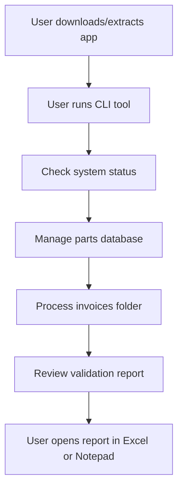

# Invoice Rate Detection System - Development Guide

**THIS SYSTEM HAS NEVER BEEN DEPLOYED. WE DO NOT NEED TO MAINTAIN BACKWARDS COMPATABILITY FOR DEPRICATED FEATURES**

## Solution Overview

- **User**: Single, non-technical user (business owner) on a desktop (Windows/Mac/Linux).
- **Interface**: Modern CLI tool with subcommands for different operations.
- **Workflow**: User manages parts database, processes invoices, and receives detailed validation reports.
- **Configuration**: Parts database with expected rates, configurable validation strategies.
- **No post-processing**: The report is for manual use; no integration with accounting/email/etc.
- **No security or multi-user concerns.**

---

## Minimal User Flow



---

## CLI Examples

```sh
# Check system status
uv run invoice-checker status

# Process invoices with validation
uv run invoice-checker process --input /path/to/invoices --output report.csv

# Manage parts database
uv run invoice-checker parts list
uv run invoice-checker parts add --code "GS0448" --description "SHIRT WORK LS BTN COTTON" --rate 0.30

# Interactive parts discovery
uv run invoice-checker discover --input /path/to/invoices
```

---

## Report Example

see report_format_specifications

---

## Key Features

- **Parts Database Integration**: SQLite database for known parts and expected rates.
- **Advanced Validation**: Multiple validation strategies beyond simple threshold checking.
- **Interactive Discovery**: Discover and add new parts from invoices interactively.
- **Batch Processing**: Process entire folders of PDF invoices at once.
- **Modular Architecture**: Clean separation of CLI, processing, and database layers.
- **Simple Output**: CSV or TXT reports, easy to open in Excel/Notepad.
- **No GUI, No Web, No Docker required**: Just Python and dependencies.

---

## Implementation Architecture

1. **CLI Module**: Command-line interface with subcommands (status, process, parts, discover).
2. **Processing Module**: PDF text extraction using pdfplumber, line item parsing.
3. **Database Module**: SQLite database operations for parts management.
4. **Validation Engine**: Multiple validation strategies and business rules.
5. **Report Generation**: CSV and TXT report generation with detailed results.
6. **Error Handling**: Comprehensive error handling and user-friendly messages.

---

## Deployment

- User downloads a ZIP or folder with the modern CLI application.
- User installs with `uv pip install -e .` or runs directly with `uv run`.
- No installation or admin rights required (except Python and UV).
- Database is created automatically on first run.

---

## Notes

- **Cost, ease of use, and clarity are prioritized.**
- **Modern architecture with clean separation of concerns.**
- **Extensible validation system for future requirements.**
- **No post-processing or automation beyond the report.**
- **We must use the composite key for the primary key**