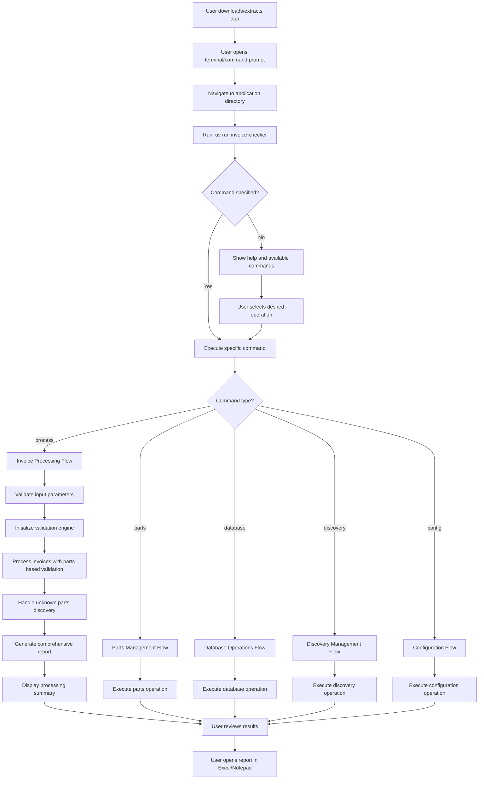
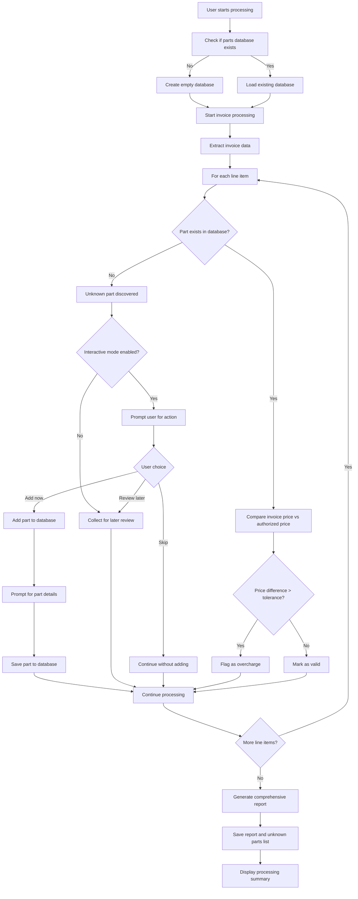
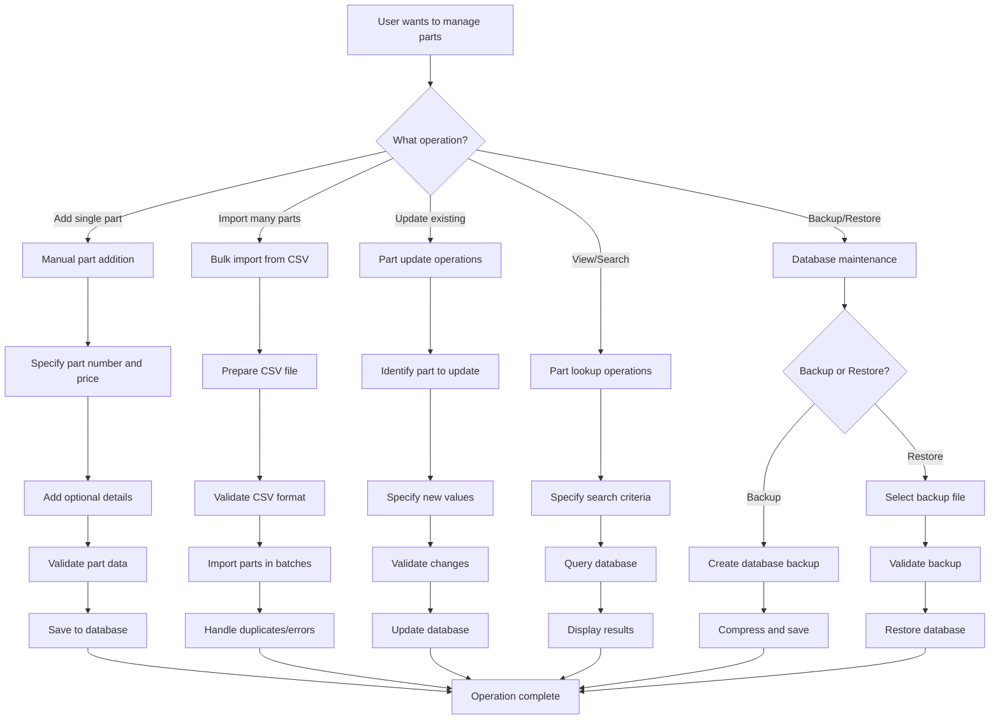
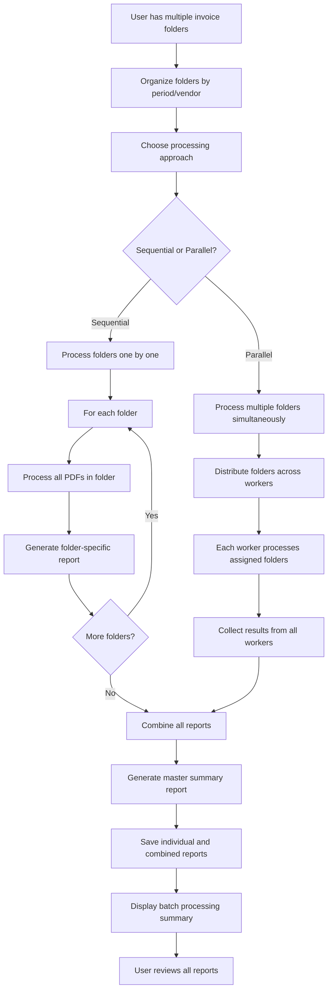
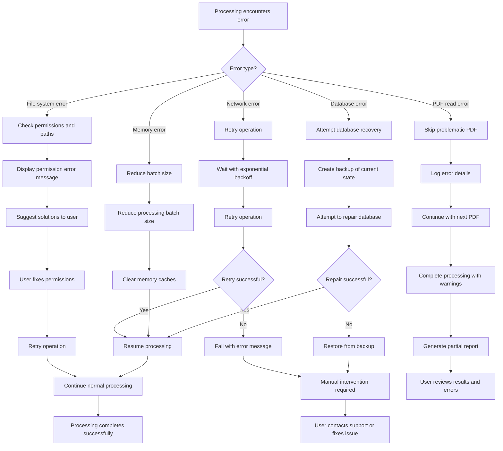
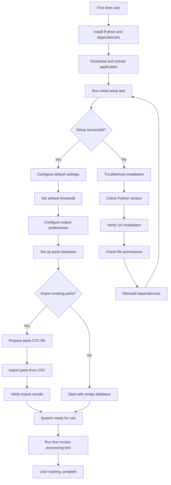
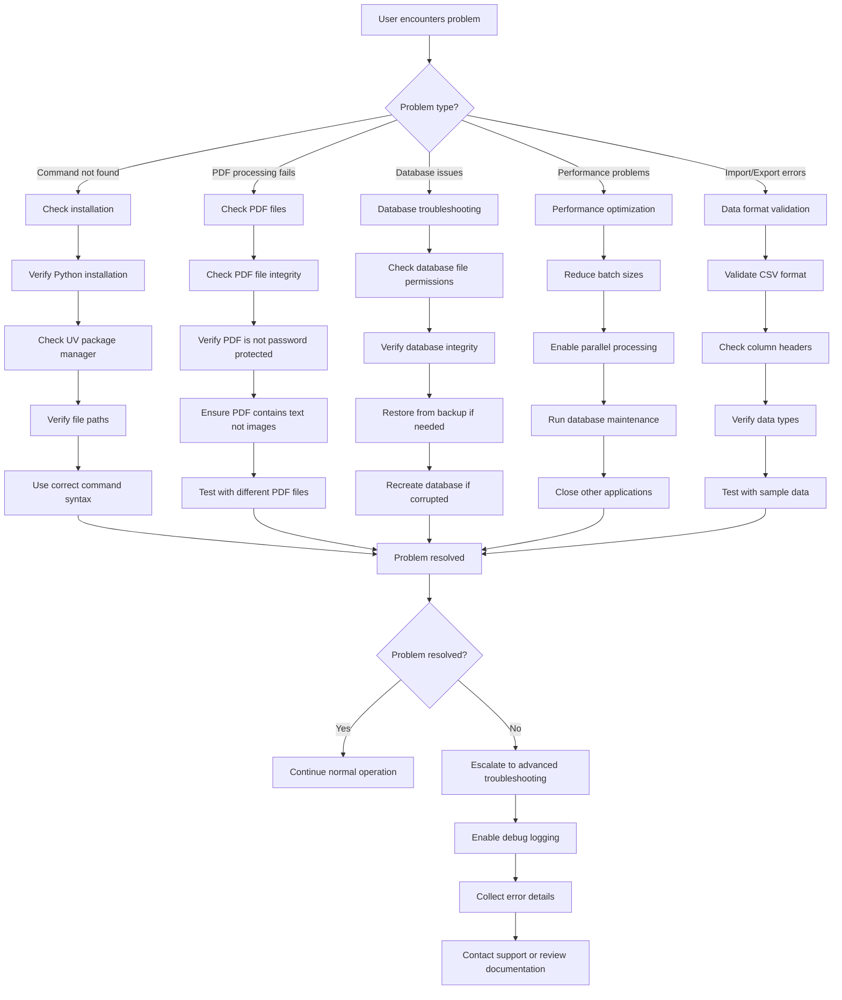

# Invoice Rate Detection System - User Flows

This document provides visual representations of the various user flows supported by the Invoice Rate Detection System.

## Primary User Flow - Modern CLI Processing

## Advanced User Flow - Parts-Based Validation

## Database Management Flow

## Batch Processing Flow

## Error Handling and Recovery Flow

## Configuration and Setup Flow

## Troubleshooting Flow

---

## Flow Descriptions

### Primary User Flow
The main workflow for invoice processing using the modern CLI system with comprehensive parts-based validation and interactive discovery features.

### Advanced User Flow
The comprehensive workflow for parts-based validation with interactive discovery, representing the full feature set of the modern CLI system.

### Database Management Flow
Comprehensive workflow for managing the parts database, including adding, updating, importing, and maintaining parts data through the modern CLI interface.

### Batch Processing Flow
Workflow for processing multiple folders of invoices simultaneously, with options for sequential or parallel processing using the modern CLI batch commands.

### Error Handling and Recovery Flow
System behavior when encountering various types of errors, with automatic recovery mechanisms, user guidance, and centralized error handling.

### Configuration and Setup Flow
Initial setup process for new users, including installation verification, basic configuration, and modern CLI system initialization.

### Troubleshooting Flow
Systematic approach to diagnosing and resolving common issues users may encounter with the modern CLI system.