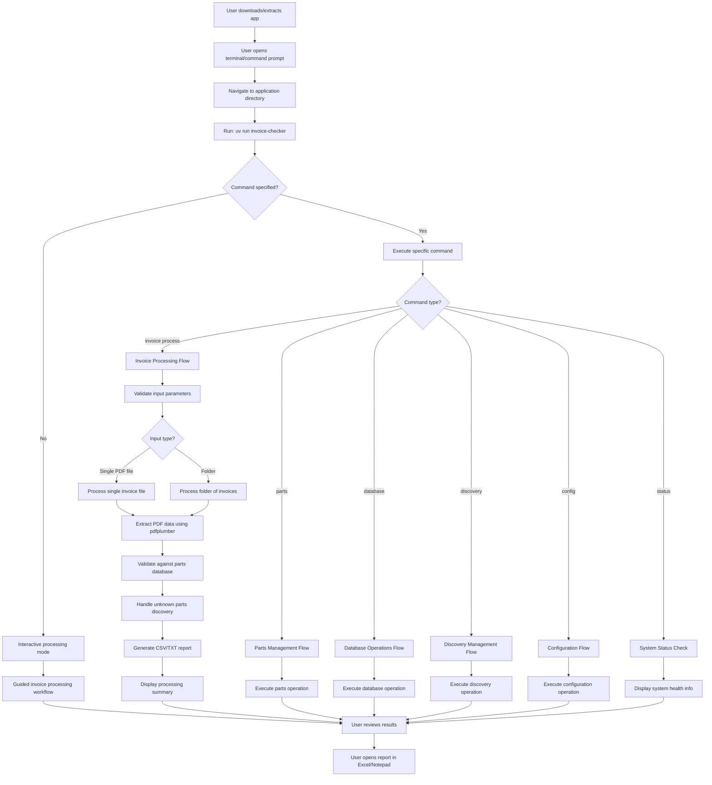
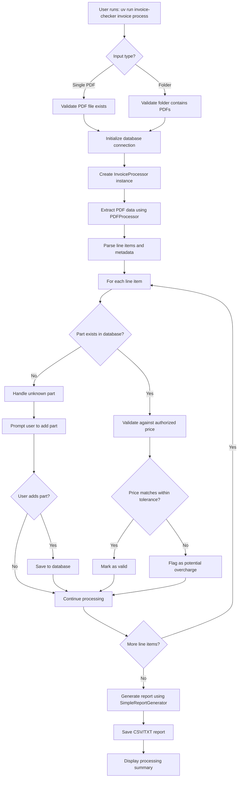
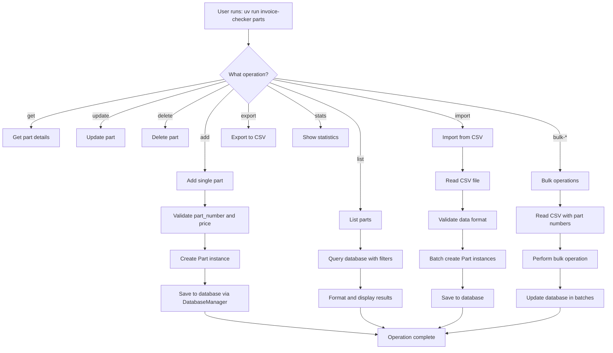
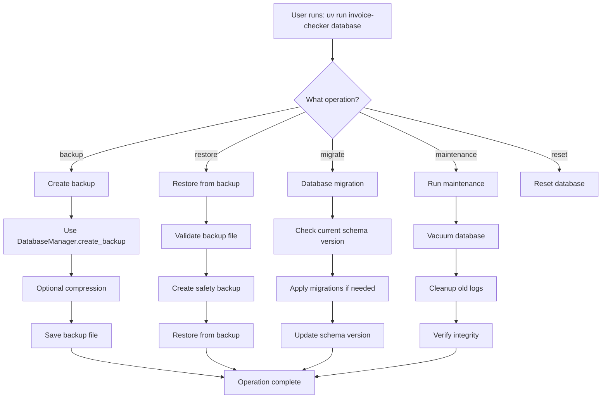
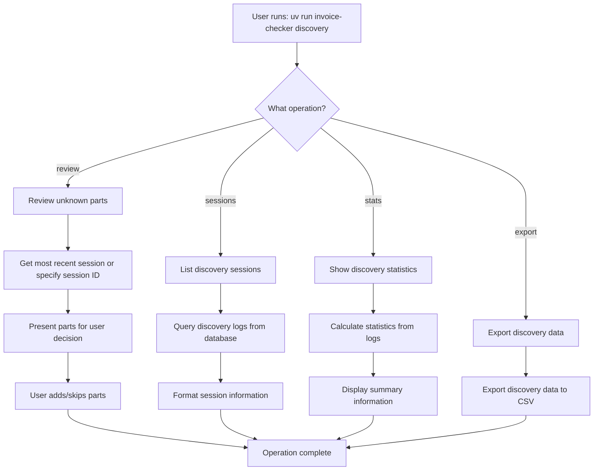
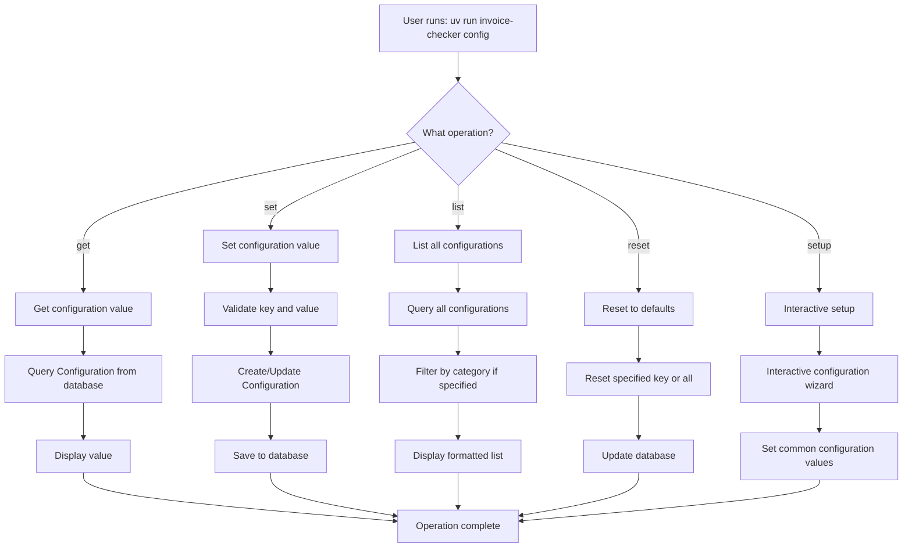
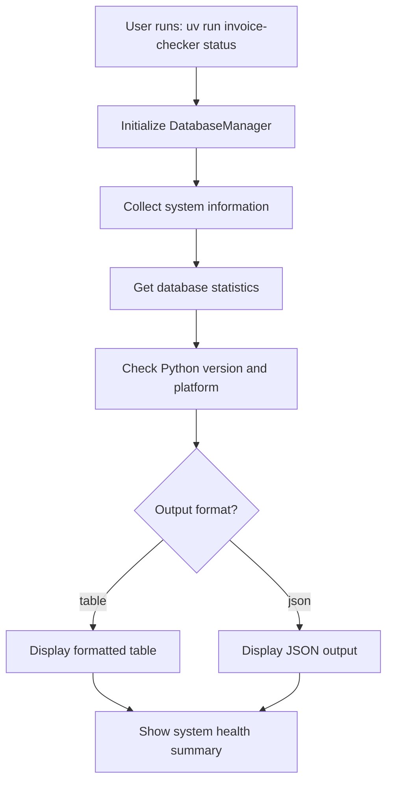

# Invoice Rate Detection System - User Flows

This document provides visual representations of the various user flows supported by the Invoice Rate Detection System.

## Primary User Flow - Modern CLI Processing

## Simplified Processing Flow

## Parts Management Flow

## Database Operations Flow

## Discovery Management Flow

## Configuration Management Flow

## System Status Flow

---

## Flow Descriptions

### Primary User Flow
The main workflow for invoice processing using the modern CLI system. Users can run the tool without arguments for interactive mode, or use specific commands for direct operations. The system automatically initializes the database and provides comprehensive parts-based validation.

### Processing Flow
The core invoice processing workflow showing how the system extracts PDF data using PDFProcessor, validates against the parts database using ValidationEngine, handles unknown parts through SimplePartDiscoveryService (always in interactive mode), and generates reports using SimpleReportGenerator.

### Parts Management Flow
Comprehensive workflow for managing the parts database through the `parts` command group. Includes operations for adding, listing, updating, deleting, importing, exporting, and bulk operations on parts data stored in the SQLite database.

### Database Operations Flow
Workflow for database maintenance operations through the `database` command group. Includes backup creation, restoration, schema migration, maintenance tasks, and database reset functionality.

### Discovery Management Flow
Workflow for managing unknown parts discovery through the `discovery` command group. The system always operates in interactive mode when unknown parts are encountered. Users can review discovered parts from previous processing sessions, view statistics, and export discovery data.

### Configuration Management Flow
Workflow for system configuration through the `config` command group. Provides get/set operations for configuration values stored in the database, with support for different data types and categories.

### System Status Flow
Simple workflow for checking system health and database connectivity through the `status` command. Displays key system information including database statistics, Python version, and platform details.