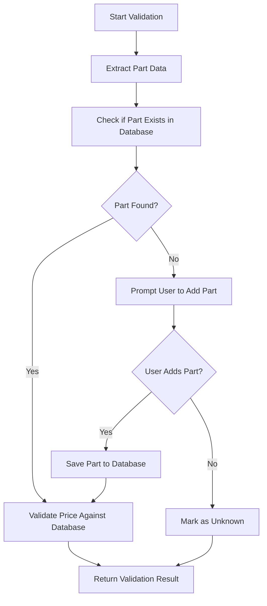

# Validation Engine Refactor Guide

## Overview

This document provides detailed instructions for refactoring the invoice validation system to eliminate the complex `interactive_discovery` configuration and integrate discovery directly into the validation process.

## Current Problem

The existing system has an overly complex architecture with:
- Separate discovery processes that can be enabled/disabled
- `interactive_discovery` configuration that creates confusion
- Non-interactive modes that leave unknown parts unhandled
- Complex conditional logic throughout the codebase

## New Simplified Architecture

### How Validation Should Work

The new validation process follows this simple, streamlined flow:



### Key Principles

1. **Discovery Always Happens**: When a part is not found, the user is ALWAYS prompted to add it
2. **No Configuration Needed**: No `interactive_discovery` setting - it's always enabled
3. **Integrated Process**: Discovery is part of validation, not a separate step
4. **Simple Flow**: Check → Not Found → Prompt → Add → Validate

## Refactoring Instructions

### Phase 1: Core Validation Engine

#### 1.1 Update ValidationEngine Constructor

**File**: `processing/validation_engine.py`

**Remove**:
```python
def __init__(self, 
             db_manager: DatabaseManager,
             interactive_mode: bool = False,  # REMOVE THIS
             config: Optional[ValidationConfiguration] = None):
```

**Replace with**:
```python
def __init__(self, 
             db_manager: DatabaseManager,
             config: Optional[ValidationConfiguration] = None):
```

**Remove**:
```python
self.interactive_mode = interactive_mode
# Initialize discovery service for interactive mode
if interactive_mode:
    self.discovery_service = SimplePartDiscoveryService(db_manager, interactive_mode)
else:
    self.discovery_service = None
```

**Replace with**:
```python
# Always initialize discovery service - discovery always happens
self.discovery_service = SimplePartDiscoveryService(db_manager)
```

#### 1.2 Simplify Part Validation Logic

**File**: `processing/validation_engine.py`

In `_validate_single_part()` method, replace the complex conditional discovery logic with:

```python
else:
    # Part not found in database - ALWAYS prompt user to add it
    try:
        # Create part data for discovery service
        discovery_part_data = {
            'database_fields': {
                'part_number': part_number,
                'authorized_price': extracted_price,
                'description': description,
                'item_type': item_type
            },
            'lineitem_fields': line_fields
        }
        
        # Use discovery service to handle unknown part
        discovery_result = self.discovery_service.discover_and_add_parts({
            'parts': [discovery_part_data]
        })
        
        # Try to find the part again after discovery
        existing_part = self.db_manager.find_part_by_components(item_type, description, part_number)
        
        if existing_part:
            # Part was added, now validate it
            # [validation logic here]
        else:
            # User chose not to add the part
            validated_part['validation_status'] = 'UNKNOWN'
            validated_part['validation_errors'].append('Part not found in database (user skipped adding)')
            
    except Exception as e:
        # Discovery failed or was cancelled
        validated_part['validation_status'] = 'UNKNOWN'
        validated_part['validation_errors'].append(f'Part not found in database (discovery failed: {str(e)})')
```

#### 1.3 Update Factory Function

**File**: `processing/validation_engine.py`

**Remove**:
```python
def create_validation_engine(db_manager: DatabaseManager, 
                           interactive_mode: bool = False,
                           config: Optional[ValidationConfiguration] = None) -> ValidationEngine:
```

**Replace with**:
```python
def create_validation_engine(db_manager: DatabaseManager, 
                           config: Optional[ValidationConfiguration] = None) -> ValidationEngine:
```

### Phase 2: Remove Interactive Discovery Configuration

#### 2.1 Database Configuration

**Files to Update**:
- `database/database.py`
- `database/db_migration.py`
- `database/models.py`

**Remove** all references to `interactive_discovery` configuration:
- Remove from `DEFAULT_CONFIGURATIONS`
- Remove from migration scripts
- Remove from configuration models

#### 2.2 Validation Models

**File**: `processing/validation_models.py`

**Remove**:
```python
interactive_discovery: bool = True
```

**Remove** from `to_dict()` method:
```python
'interactive_discovery': self.interactive_discovery,
```

**Remove** from `from_database_config()` method:
```python
config.interactive_discovery = db_manager.get_config_value(
    'interactive_discovery', config.interactive_discovery
)
```

### Phase 3: CLI Commands

#### 3.1 Invoice Commands

**File**: `cli/commands/invoice_commands.py`

**Remove** all references to:
- `interactive_discovery` parameter
- `interactive` parameter in validation configuration
- Conditional logic based on interactive mode

**Update** all calls to `ValidationEngine()` to remove `interactive_mode` parameter.

#### 3.2 Discovery Commands

**File**: `cli/commands/discovery_commands.py`

**Consider removing entirely** or simplifying to just review discovered parts, since discovery is now integrated into validation.

#### 3.3 Configuration Commands

**File**: `cli/commands/config_commands.py`

**Remove** any references to `interactive_discovery` configuration.

### Phase 4: Test Updates

#### 4.1 Unit Tests

**Files to Update**:
- `tests_unit/test_database.py`
- `tests_unit/test_invoice_processing_refactored.py`
- `tests_unit/test_part_discovery.py`

**Remove**:
- Tests that check `interactive_discovery` configuration
- Tests that verify non-interactive behavior
- Mock setups that use `interactive_mode=False`

**Update**:
- All `ValidationEngine` instantiations to remove `interactive_mode` parameter
- Test expectations to assume discovery always happens

#### 4.2 Integration Tests

**Files to Update**:
- `tests_e2e/test_configuration_management.py`
- `tests_e2e/test_initial_database_setup.py`
- `tests_e2e/test_report_generation.py`

**Remove**:
- Tests for `interactive_discovery` configuration
- Tests for non-interactive processing modes

#### 4.3 Journey Tests

**Files to Update**:
- `tests_journey/test_user_cancellation_flows.py`
- `tests_journey/test_multi_step_workflow_state.py`

**Update**:
- Tests to expect discovery prompts always appear
- Remove tests for non-interactive modes

### Phase 5: Documentation Updates

#### 5.1 User Documentation

**Files to Update**:
- `docs/USER_MANUAL.md`
- `docs/USER_FLOWS.md`
- `README.md`

**Remove**:
- References to `interactive_discovery` configuration
- Documentation about enabling/disabling discovery
- Non-interactive processing examples

**Update**:
- Flow diagrams to show integrated discovery
- Examples to show discovery always happens

#### 5.2 Technical Documentation

**Files to Update**:
- `docs/INTERACTIVE_PART_DISCOVERY.md`
- `docs/design/validation_logic_specification.md`

**Update**:
- Architecture diagrams
- Process flow descriptions
- Configuration specifications

## What Needs to Be Completely Removed

### Configuration Items
- `interactive_discovery` database configuration
- `interactive_discovery` validation model field
- `interactive_mode` parameter in ValidationEngine
- All conditional logic based on interactive mode

### CLI Options
- Any CLI flags for enabling/disabling discovery
- Non-interactive processing modes
- Batch collection without user interaction

### Test Cases
- Tests for non-interactive behavior
- Tests for `interactive_discovery` configuration
- Mock scenarios with `interactive_mode=False`

### Documentation
- References to optional discovery
- Non-interactive processing workflows
- Configuration guides for discovery settings

## What to Ensure Does Not Break

### Core Functionality
- **Part validation logic**: Ensure price comparison still works
- **Database operations**: Ensure part lookup and creation still work
- **Report generation**: Ensure validation results are properly formatted
- **Error handling**: Ensure graceful handling of discovery failures

### User Experience
- **Discovery prompts**: Ensure users can still add/skip parts
- **Validation feedback**: Ensure clear status messages
- **Progress indicators**: Ensure processing feedback works
- **Error messages**: Ensure meaningful error descriptions

### Integration Points
- **CLI commands**: Ensure all invoice processing commands work
- **Database schema**: Ensure no breaking changes to database structure
- **Report formats**: Ensure CSV/TXT output remains consistent
- **File processing**: Ensure PDF extraction and parsing work

### Testing
- **Unit tests**: Ensure core validation logic tests pass
- **Integration tests**: Ensure end-to-end workflows work
- **Journey tests**: Ensure user interaction flows work
- **Performance**: Ensure no significant performance degradation

## Migration Strategy

### Step 1: Update Core Engine
1. Modify `ValidationEngine` class
2. Update factory functions
3. Run unit tests to verify core logic

### Step 2: Remove Configuration
1. Remove database configurations
2. Update validation models
3. Run configuration tests

### Step 3: Update CLI
1. Modify command implementations
2. Remove discovery-specific commands
3. Run CLI tests

### Step 4: Clean Up Tests
1. Remove obsolete test cases
2. Update remaining tests
3. Run full test suite

### Step 5: Update Documentation
1. Update user guides
2. Update technical documentation
3. Review and validate all changes

## Validation Checklist

- [ ] ValidationEngine no longer accepts `interactive_mode` parameter
- [ ] Discovery service is always initialized
- [ ] Unknown parts always trigger user prompts
- [ ] No `interactive_discovery` configuration exists
- [ ] All CLI commands work without interactive flags
- [ ] All tests pass with new architecture
- [ ] Documentation reflects simplified process
- [ ] User experience remains intuitive
- [ ] Performance is not degraded
- [ ] Error handling is robust

## Benefits of This Refactor

1. **Simplified Architecture**: Eliminates complex conditional logic
2. **Better User Experience**: Users always get prompted for unknown parts
3. **Reduced Configuration**: No confusing settings to manage
4. **Cleaner Code**: Less branching and conditional complexity
5. **Easier Testing**: Fewer code paths to test
6. **Better Maintainability**: Single, clear workflow to maintain

## Conclusion

This refactor transforms the validation system from a complex, configurable process to a simple, streamlined workflow where discovery is always integrated into validation. The result is a more intuitive, maintainable, and user-friendly system.