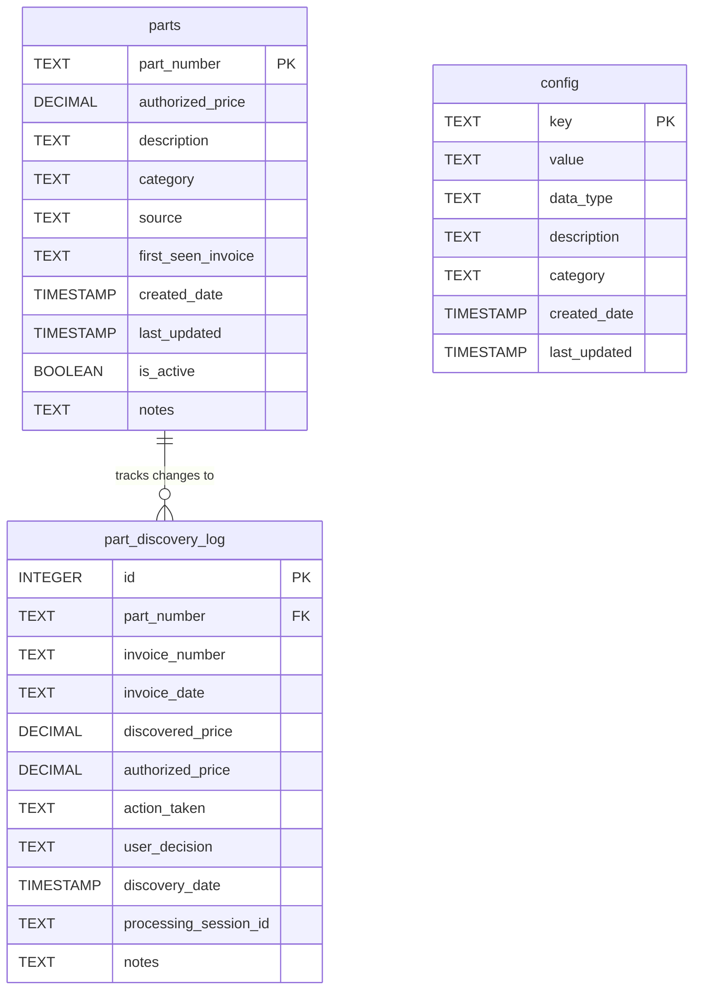

# Invoice Rate Detection System - Database Schema Design

## Overview

This document defines the SQLite database schema for the Invoice Rate Detection System, replacing the threshold-based validation with a comprehensive parts-based validation system with master data management and audit trail capabilities.

## Database Schema

### 1. Parts Table (`parts`)

**Purpose**: Master parts database storing authorized part numbers, prices, and metadata for validation.

```sql
CREATE TABLE parts (
    part_number TEXT PRIMARY KEY,
    authorized_price DECIMAL(10,4) NOT NULL,
    description TEXT,
    category TEXT,
    source TEXT DEFAULT 'manual',
    first_seen_invoice TEXT,
    created_date TIMESTAMP DEFAULT CURRENT_TIMESTAMP,
    last_updated TIMESTAMP DEFAULT CURRENT_TIMESTAMP,
    is_active BOOLEAN DEFAULT 1,
    notes TEXT
);
```

**Field Descriptions**:
- `part_number`: Primary key, unique part identifier (e.g., "GS0448", "GP0171NAVY")
- `authorized_price`: Expected/authorized price with 4 decimal precision for accuracy
- `description`: Human-readable part description (e.g., "SHIRT WORK LS BTN COTTON")
- `category`: Optional categorization for parts organization
- `source`: How the part was added ('manual', 'discovered', 'imported')
- `first_seen_invoice`: Invoice number where this part was first discovered
- `created_date`: When the part was added to the database
- `last_updated`: When the part was last modified
- `is_active`: Soft delete flag for deactivating parts without losing history
- `notes`: Additional notes or comments about the part

### 2. Configuration Table (`config`)

**Purpose**: System configuration settings and user preferences.

```sql
CREATE TABLE config (
    key TEXT PRIMARY KEY,
    value TEXT NOT NULL,
    data_type TEXT DEFAULT 'string',
    description TEXT,
    category TEXT DEFAULT 'general',
    created_date TIMESTAMP DEFAULT CURRENT_TIMESTAMP,
    last_updated TIMESTAMP DEFAULT CURRENT_TIMESTAMP
);
```

**Field Descriptions**:
- `key`: Configuration setting name (e.g., "default_output_format", "validation_mode")
- `value`: Configuration value stored as text
- `data_type`: Type hint for value parsing ('string', 'number', 'boolean', 'json')
- `description`: Human-readable description of the setting
- `category`: Grouping for related settings ('validation', 'reporting', 'discovery')
- `created_date`: When the setting was first created
- `last_updated`: When the setting was last modified

### 3. Part Discovery Log Table (`part_discovery_log`)

**Purpose**: Audit trail for all part discovery and modification actions.

```sql
CREATE TABLE part_discovery_log (
    id INTEGER PRIMARY KEY AUTOINCREMENT,
    part_number TEXT NOT NULL,
    invoice_number TEXT,
    invoice_date TEXT,
    discovered_price DECIMAL(10,4),
    authorized_price DECIMAL(10,4),
    action_taken TEXT NOT NULL,
    user_decision TEXT,
    discovery_date TIMESTAMP DEFAULT CURRENT_TIMESTAMP,
    processing_session_id TEXT,
    notes TEXT,
    FOREIGN KEY (part_number) REFERENCES parts(part_number) ON DELETE SET NULL
);
```

**Field Descriptions**:
- `id`: Auto-incrementing primary key
- `part_number`: Part number that was discovered/modified
- `invoice_number`: Invoice where the part was found
- `invoice_date`: Date of the invoice
- `discovered_price`: Price found in the invoice
- `authorized_price`: Authorized price at time of discovery
- `action_taken`: Action performed ('discovered', 'added', 'updated', 'skipped', 'price_mismatch')
- `user_decision`: User's decision during interactive discovery
- `discovery_date`: When the discovery occurred
- `processing_session_id`: UUID to group discoveries from same processing run
- `notes`: Additional context or user notes

## Indexes for Performance

```sql
-- Primary lookup index for parts validation
CREATE INDEX idx_parts_number ON parts(part_number);

-- Index for active parts queries
CREATE INDEX idx_parts_active ON parts(is_active) WHERE is_active = 1;

-- Index for parts by category
CREATE INDEX idx_parts_category ON parts(category);

-- Index for configuration lookups
CREATE INDEX idx_config_category ON config(category);

-- Index for discovery log queries by part
CREATE INDEX idx_discovery_part ON part_discovery_log(part_number);

-- Index for discovery log queries by invoice
CREATE INDEX idx_discovery_invoice ON part_discovery_log(invoice_number);

-- Index for discovery log queries by date
CREATE INDEX idx_discovery_date ON part_discovery_log(discovery_date);

-- Index for discovery log queries by session
CREATE INDEX idx_discovery_session ON part_discovery_log(processing_session_id);
```

## Database Relationships



## Data Integrity Constraints

### Parts Table Constraints
- `part_number`: NOT NULL, PRIMARY KEY, must be unique
- `authorized_price`: NOT NULL, must be positive (CHECK authorized_price > 0)
- `is_active`: DEFAULT 1, must be 0 or 1

### Config Table Constraints
- `key`: NOT NULL, PRIMARY KEY, must be unique
- `value`: NOT NULL
- `data_type`: Must be one of ('string', 'number', 'boolean', 'json')

### Part Discovery Log Constraints
- `part_number`: NOT NULL
- `action_taken`: NOT NULL, must be one of ('discovered', 'added', 'updated', 'skipped', 'price_mismatch')
- `discovered_price`: Must be positive when not NULL
- `authorized_price`: Must be positive when not NULL

## Initial Configuration Data

```sql
-- Default configuration settings
INSERT INTO config (key, value, data_type, description, category) VALUES
('validation_mode', 'parts_based', 'string', 'Validation mode: parts_based or threshold_based', 'validation'),
('default_output_format', 'csv', 'string', 'Default report output format', 'reporting'),
('interactive_discovery', 'true', 'boolean', 'Enable interactive part discovery during processing', 'discovery'),
('auto_add_discovered_parts', 'false', 'boolean', 'Automatically add discovered parts without user confirmation', 'discovery'),
('price_tolerance', '0.001', 'number', 'Price comparison tolerance for floating point precision', 'validation'),
('backup_retention_days', '30', 'number', 'Number of days to retain database backups', 'maintenance'),
('log_retention_days', '365', 'number', 'Number of days to retain discovery log entries', 'maintenance');
```

## CRUD Operations Support

### Parts Management
- **Create**: INSERT new parts with validation
- **Read**: SELECT parts by number, category, active status
- **Update**: UPDATE authorized prices, descriptions, metadata
- **Delete**: Soft delete using `is_active` flag to preserve audit trail

### Configuration Management
- **Create**: INSERT new configuration keys
- **Read**: SELECT configuration by key or category
- **Update**: UPDATE configuration values with timestamp tracking
- **Delete**: DELETE unused configuration keys

### Discovery Log Management
- **Create**: INSERT discovery events during processing
- **Read**: SELECT discovery history by part, invoice, date, session
- **Update**: Not typically needed (append-only audit log)
- **Delete**: Cleanup old entries based on retention policy

## Backup and Restore Support

### Backup Strategy
- Full database backup: Copy entire SQLite file
- Incremental backup: Export specific tables with timestamps
- Configuration backup: Export config table separately
- Parts backup: Export parts table with metadata

### Restore Strategy
- Full restore: Replace SQLite file
- Selective restore: Import specific tables
- Merge restore: Import parts while preserving existing data
- Configuration restore: Update config table from backup

## Performance Considerations

### Query Optimization
- Primary key lookups on `parts.part_number` are O(log n)
- Indexed queries on discovery log are optimized for common access patterns
- Configuration lookups are fast due to small table size

### Scalability
- Designed to handle 10,000+ parts without performance degradation
- Discovery log can grow large but is indexed for efficient querying
- Regular cleanup of old discovery log entries maintains performance

### Memory Usage
- SQLite file-based storage minimizes memory footprint
- Indexes are loaded on-demand
- Connection pooling not needed for single-user desktop application

## Data Migration Considerations

### From Threshold-Based System
- No existing database to migrate
- Initial parts data will be populated through discovery process
- Configuration migrated from command-line defaults

### Future Schema Changes
- Use ALTER TABLE for non-breaking changes
- Create migration scripts for breaking changes
- Maintain version tracking in config table

## Security Considerations

### Data Protection
- SQLite file permissions restrict access to application user
- No sensitive data stored (part numbers and prices are business data)
- Audit trail provides accountability for changes

### Input Validation
- Part numbers validated against expected patterns
- Prices validated as positive decimal values
- Configuration values validated against expected types

## SQL Migration Script

```sql
-- Invoice Rate Detection System - Database Migration Script
-- Version: 1.0
-- Description: Initial database schema creation

-- Enable foreign key constraints
PRAGMA foreign_keys = ON;

-- Create parts table
CREATE TABLE parts (
    part_number TEXT PRIMARY KEY,
    authorized_price DECIMAL(10,4) NOT NULL CHECK (authorized_price > 0),
    description TEXT,
    category TEXT,
    source TEXT DEFAULT 'manual' CHECK (source IN ('manual', 'discovered', 'imported')),
    first_seen_invoice TEXT,
    created_date TIMESTAMP DEFAULT CURRENT_TIMESTAMP,
    last_updated TIMESTAMP DEFAULT CURRENT_TIMESTAMP,
    is_active BOOLEAN DEFAULT 1 CHECK (is_active IN (0, 1)),
    notes TEXT
);

-- Create config table
CREATE TABLE config (
    key TEXT PRIMARY KEY,
    value TEXT NOT NULL,
    data_type TEXT DEFAULT 'string' CHECK (data_type IN ('string', 'number', 'boolean', 'json')),
    description TEXT,
    category TEXT DEFAULT 'general',
    created_date TIMESTAMP DEFAULT CURRENT_TIMESTAMP,
    last_updated TIMESTAMP DEFAULT CURRENT_TIMESTAMP
);

-- Create part discovery log table
CREATE TABLE part_discovery_log (
    id INTEGER PRIMARY KEY AUTOINCREMENT,
    part_number TEXT NOT NULL,
    invoice_number TEXT,
    invoice_date TEXT,
    discovered_price DECIMAL(10,4) CHECK (discovered_price IS NULL OR discovered_price > 0),
    authorized_price DECIMAL(10,4) CHECK (authorized_price IS NULL OR authorized_price > 0),
    action_taken TEXT NOT NULL CHECK (action_taken IN ('discovered', 'added', 'updated', 'skipped', 'price_mismatch')),
    user_decision TEXT,
    discovery_date TIMESTAMP DEFAULT CURRENT_TIMESTAMP,
    processing_session_id TEXT,
    notes TEXT,
    FOREIGN KEY (part_number) REFERENCES parts(part_number) ON DELETE SET NULL
);

-- Create indexes for performance
CREATE INDEX idx_parts_number ON parts(part_number);
CREATE INDEX idx_parts_active ON parts(is_active) WHERE is_active = 1;
CREATE INDEX idx_parts_category ON parts(category);
CREATE INDEX idx_config_category ON config(category);
CREATE INDEX idx_discovery_part ON part_discovery_log(part_number);
CREATE INDEX idx_discovery_invoice ON part_discovery_log(invoice_number);
CREATE INDEX idx_discovery_date ON part_discovery_log(discovery_date);
CREATE INDEX idx_discovery_session ON part_discovery_log(processing_session_id);

-- Insert initial configuration data
INSERT INTO config (key, value, data_type, description, category) VALUES
('validation_mode', 'parts_based', 'string', 'Validation mode: parts_based or threshold_based', 'validation'),
('default_output_format', 'csv', 'string', 'Default report output format', 'reporting'),
('interactive_discovery', 'true', 'boolean', 'Enable interactive part discovery during processing', 'discovery'),
('auto_add_discovered_parts', 'false', 'boolean', 'Automatically add discovered parts without user confirmation', 'discovery'),
('price_tolerance', '0.001', 'number', 'Price comparison tolerance for floating point precision', 'validation'),
('backup_retention_days', '30', 'number', 'Number of days to retain database backups', 'maintenance'),
('log_retention_days', '365', 'number', 'Number of days to retain discovery log entries', 'maintenance'),
('database_version', '1.0', 'string', 'Current database schema version', 'system');

-- Create triggers to update last_updated timestamps
CREATE TRIGGER update_parts_timestamp
    AFTER UPDATE ON parts
    FOR EACH ROW
    BEGIN
        UPDATE parts SET last_updated = CURRENT_TIMESTAMP WHERE part_number = NEW.part_number;
    END;

CREATE TRIGGER update_config_timestamp
    AFTER UPDATE ON config
    FOR EACH ROW
    BEGIN
        UPDATE config SET last_updated = CURRENT_TIMESTAMP WHERE key = NEW.key;
    END;

-- Create view for active parts (commonly used query)
CREATE VIEW active_parts AS
SELECT part_number, authorized_price, description, category, source, first_seen_invoice, created_date, last_updated, notes
FROM parts
WHERE is_active = 1;

-- Create view for recent discoveries (last 30 days)
CREATE VIEW recent_discoveries AS
SELECT pdl.*, p.description, p.authorized_price as current_authorized_price
FROM part_discovery_log pdl
LEFT JOIN parts p ON pdl.part_number = p.part_number
WHERE pdl.discovery_date >= datetime('now', '-30 days')
ORDER BY pdl.discovery_date DESC;
```

## Testing Strategy

### Unit Tests
- Test CRUD operations for each table
- Test constraint validation
- Test index performance
- Test trigger functionality
- Test view queries

### Integration Tests
- Test complete discovery workflow
- Test backup/restore functionality
- Test configuration management
- Test foreign key constraints

### Performance Tests
- Test with large parts database (10,000+ parts)
- Test discovery log performance with high volume
- Test concurrent access scenarios
- Test index effectiveness