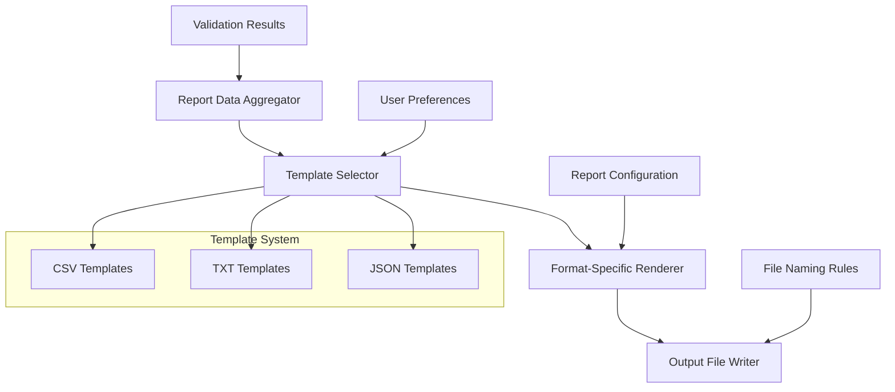

# Invoice Rate Detection System - Report Format Specification

**Document Version**: 1.0  
**Date**: July 29, 2025  
**Author**: System Architect  

---

## Table of Contents

1. [Overview](#overview)
2. [Report Types and Purposes](#report-types-and-purposes)
3. [Primary CSV Anomaly Report](#primary-csv-anomaly-report)
4. [Summary Report Format](#summary-report-format)
5. [Unknown Parts Report](#unknown-parts-report)
6. [Processing Statistics Report](#processing-statistics-report)
7. [Error Report Format](#error-report-format)
8. [Report Template System](#report-template-system)
9. [Export Format Specifications](#export-format-specifications)
10. [File Organization and Naming](#file-organization-and-naming)
11. [User Interpretation Guide](#user-interpretation-guide)
12. [Implementation Requirements](#implementation-requirements)

---

## Overview

The Invoice Rate Detection System generates multiple report types to serve different user needs, from immediate business decision-making to technical system monitoring. All reports are designed for non-technical business users while providing comprehensive data for analysis and action.

### Design Principles

- **User-Centric**: Reports prioritize business value and actionable information
- **Excel-Compatible**: Primary CSV format opens cleanly in Excel with proper formatting
- **Severity-Based**: Critical issues are prominently displayed and clearly distinguished
- **Comprehensive Context**: Each anomaly includes full invoice context for decision-making
- **Consistent Formatting**: Standardized date, currency, and numeric formats across all reports

---

## Report Types and Purposes

| Report Type | Primary User | Purpose | Format | Frequency |
|-------------|--------------|---------|---------|-----------|
| **Anomaly Report** | Business Owner | Identify overcharges and pricing issues | CSV | Every processing run |
| **Detailed Validation Report** | Business Owner | Line-by-line validation analysis with full context | TXT | Every processing run |
| **Summary Report** | Business Owner | High-level overview and key metrics | TXT | Every processing run |
| **Unknown Parts** | Business Owner | Manage parts not in database | CSV | When unknown parts found |
| **Processing Stats** | System Admin | Performance monitoring and optimization | JSON | Every processing run |
| **Error Report** | System Admin | Troubleshoot processing failures | TXT | When errors occur |

---

## Primary CSV Anomaly Report

### Purpose
Main business report showing all detected anomalies with complete context for decision-making.

### File Naming
`invoice_anomalies_YYYYMMDD_HHMMSS_[session_short].csv`

### Column Specifications

| Column | Data Type | Format | Description | Example |
|--------|-----------|--------|-------------|---------|
| Invoice Number | Text | String | Invoice identifier | 5790256943 |
| Invoice Date | Date | MM/DD/YYYY | Invoice date (Excel compatible) | 06/09/2025 |
| Invoice File | Text | Filename | Original PDF filename | invoice_5790256943.pdf |
| Line Number | Integer | N | Line position within invoice (1-based) | 3 |
| Part Number | Text | String | Part identifier | GS0448 |
| Part Description | Text | String | Human-readable description | SHIRT WORK LS BTN COTTON |
| Quantity | Integer | N | Number of items ordered | 8 |
| Invoice Price | Currency | $X.XX | Price charged per unit | $15.75 |
| Authorized Price | Currency | $X.XX | Expected price per unit | $15.50 |
| Price Difference | Currency | $X.XX | Absolute difference (positive = overcharge) | $0.25 |
| Percentage Difference | Percentage | X.X% | Percentage variance | 1.6% |
| Anomaly Type | Enum | String | Type of anomaly detected | PRICE_DISCREPANCY |
| Severity | Enum | String | CRITICAL, WARNING, INFORMATIONAL | WARNING |
| Financial Impact | Currency | $X.XX | Total dollar impact for this line item | $2.00 |
| Processing Session | UUID | String | Session identifier for tracking | abc123-def456 |
| Notes | Text | String | Additional context or annotations | Consistent pattern across invoices |

### Sample Data
```csv
Invoice Number,Invoice Date,Invoice File,Line Number,Part Number,Part Description,Quantity,Invoice Price,Authorized Price,Price Difference,Percentage Difference,Anomaly Type,Severity,Financial Impact,Processing Session,Notes
5790256943,06/09/2025,invoice_5790256943.pdf,3,GS0448,SHIRT WORK LS BTN COTTON,8,$15.75,$15.50,$0.25,1.6%,PRICE_DISCREPANCY,WARNING,$2.00,abc123-def456,Consistent pattern across multiple invoices
5790256943,06/09/2025,invoice_5790256943.pdf,7,GP0171NAVY,PANTS WORK NAVY,5,$22.00,$20.00,$2.00,10.0%,PRICE_DISCREPANCY,CRITICAL,$10.00,abc123-def456,Price increase not authorized
5790256944,06/10/2025,invoice_5790256944.pdf,2,XYZ999,UNKNOWN SAFETY VEST,3,$45.00,N/A,N/A,N/A,MISSING_PART,CRITICAL,$135.00,abc123-def456,Part not found in master database
```

### Sorting Rules
1. **Primary Sort**: Severity (CRITICAL first, then WARNING, then INFORMATIONAL)
2. **Secondary Sort**: Financial Impact (highest first)
3. **Tertiary Sort**: Invoice Date (newest first)

---

## Detailed Validation Report Format (TXT)

### Purpose
Comprehensive human-readable report showing detailed validation results with line-by-line analysis for business review.

### File Naming
`invoice_validation_report_YYYYMMDD_HHMMSS_[session_short].txt`

### Structure Template
```
Invoice Rate Detection System - Detailed Validation Report
============================================================
Generated: YYYY-MM-DD HH:MM:SS
Validation Mode: [Threshold: $X.XX/Part Validation]

============================================================
INVOICE: [Invoice Number]
============================================================
Invoice Date: MM/DD/YYYY
Lines Processed: XX

RATE VALIDATION ERRORS:
------------------------

Line X: [Employee Name] - [Part Number] [Part Description]
  Actual Rate: $X.XXX  |  Expected Rate: $X.XXX  |  Difference: ±$X.XXX
  Quantity: X  |  Line Adjustment: ±$X.XX

[Repeat for each validation error...]

INVOICE TOTALS VALIDATION:
--------------------------
Subtotal: [$]
Freight: [$]
Tax: [$]
Total: [$]
validation: [passed/failed]

Invoice [Number] Summary:
  Error Lines: XX of XX total lines
  Invoice Adjustment: ±$XX.XX

[Repeat invoice section for each processed invoice...]

============================================================
PROCESSING SUMMARY
============================================================

Total Invoices Processed: X

Line Error Analysis:
  Total Error Lines: XX
  Errored Invoices: [Invoice Numbers]

Rate Validation Issues:
  Lines with rates above threshold ($X.XX): XX
  Lines with rates below threshold ($X.XX): XX
  Lines with zero rates: XX

Financial Impact:
  Total Adjustment Required: ±$XX.XX
  Overcharges: $XX.XX
  Undercharges: -$XX.XX
  Net Adjustment: ±$XX.XX

Subtotal Error Analysis:
  Total Errored Invoices: XX
  Errored Invoices: [Invoice Numbers]

Processing Performance:
  Average Processing Time: X.XXs per invoice
  Total Processing Time: X.XXs
  Lines Processed per Second: XXX

============================================================
END OF REPORT
============================================================
```

### Key Features
- **Invoice-by-Invoice Breakdown**: Each invoice gets its own detailed section
- **Line-Level Detail**: Every validation error shows specific line information
- **Employee/Part Context**: Includes employee names and full part descriptions
- **Financial Impact**: Shows both line-level and invoice-level adjustments
- **Rate Comparison**: Clear display of actual vs expected rates with differences
- **Processing Metrics**: Performance statistics for system monitoring
- **Validation Status**: Clear indicators for totals validation status

### Formatting Rules
- **Section Separators**: Use `============================================================` for major sections
- **Subsection Separators**: Use `------------------------` for subsections
- **Currency Format**: Always show 3 decimal places for rates, 2 for adjustments
- **Alignment**: Use pipe separators (`|`) for tabular data alignment
- **Indentation**: Use 2-space indentation for hierarchical information
- **Line Width**: Maximum 80 characters per line for readability

## Summary Report Format

### Purpose
High-level overview of processing results and key business metrics (legacy format maintained for compatibility).

### File Naming
`processing_summary_YYYYMMDD_HHMMSS_[session_short].txt`

### Structure Template
```
INVOICE RATE DETECTION SYSTEM - PROCESSING SUMMARY
==================================================

Processing Session: [UUID]
Date/Time: [MM/DD/YYYY HH:MM:SS]
Input Folder: [Path]
Processing Duration: [X minutes Y seconds]

PROCESSING STATISTICS
--------------------
Total Invoices Processed: XX
Successfully Processed: XX
Failed to Process: XX
Total Line Items Validated: XXX

ANOMALY SUMMARY
--------------
Total Anomalies Found: XX
├─ Critical Issues: XX
├─ Warnings: XX
└─ Informational: XX

FINANCIAL IMPACT
---------------
Total Potential Overcharges: $X,XXX.XX
Average Overcharge per Invoice: $XX.XX
Largest Single Overcharge: $XXX.XX (Invoice: XXXXXXX, Part: XXXXXX)

PARTS DISCOVERY
--------------
Unknown Parts Discovered: XX
Parts Added to Database: XX
Parts Skipped by User: XX

TOP ISSUES BY FREQUENCY
----------------------
1. [Anomaly Type]: XX occurrences
2. [Anomaly Type]: XX occurrences
3. [Anomaly Type]: XX occurrences

RECOMMENDATIONS
--------------
• Review XX critical price discrepancies immediately
• Add XX unknown parts to master database
• Investigate recurring issues with [specific patterns]

FILES GENERATED
--------------
• Main Report: invoice_anomalies_YYYYMMDD_HHMMSS.csv
• Unknown Parts: unknown_parts_YYYYMMDD_HHMMSS.csv
• Error Log: processing_errors_YYYYMMDD_HHMMSS.txt
```

---

## Unknown Parts Report

### Purpose
Dedicated report for parts not found in the master database, supporting the parts discovery workflow.

### File Naming
`unknown_parts_YYYYMMDD_HHMMSS_[session_short].csv`

### Column Specifications

| Column | Data Type | Format | Description |
|--------|-----------|--------|-------------|
| Part Number | Text | String | Unknown part identifier |
| Description | Text | String | Description from invoice |
| First Seen Invoice | Text | String | Invoice where first discovered |
| Invoice Date | Date | MM/DD/YYYY | Date of first discovery |
| Discovered Price | Currency | $X.XX | Price found in invoice |
| Quantity | Integer | N | Quantity from invoice |
| Suggested Authorized Price | Currency | $X.XX | System-suggested price |
| Confidence Level | Percentage | X.X% | Confidence in suggestion |
| Similar Parts Found | Integer | N | Number of similar parts in database |
| Recommended Action | Text | String | Suggested next step |
| Discovery Session | UUID | String | Session where discovered |
| User Decision | Text | String | User's decision during processing |

---

## Processing Statistics Report

### Purpose
Technical metrics for system performance monitoring and optimization.

### File Naming
`processing_stats_YYYYMMDD_HHMMSS_[session_short].json`

### JSON Schema
```json
{
  "session_id": "uuid",
  "processing_start": "2025-07-29T13:45:00Z",
  "processing_end": "2025-07-29T13:47:30Z",
  "duration_seconds": 150.5,
  "performance_metrics": {
    "files_per_second": 2.3,
    "validation_operations_per_second": 45.2,
    "database_queries_executed": 1250,
    "cache_hit_rate": 0.85
  },
  "file_statistics": {
    "total_files": 25,
    "successful_extractions": 23,
    "failed_extractions": 2,
    "average_file_size_mb": 1.2,
    "total_pages_processed": 47
  },
  "validation_statistics": {
    "total_line_items": 342,
    "parts_validated": 298,
    "unknown_parts": 44,
    "price_comparisons": 298,
    "format_validations": 25
  },
  "anomaly_statistics": {
    "total_anomalies": 67,
    "critical_anomalies": 12,
    "warning_anomalies": 45,
    "informational_anomalies": 10,
    "anomalies_by_type": {
      "PRICE_DISCREPANCY": 45,
      "MISSING_PART": 12,
      "FORMAT_VIOLATION": 8,
      "DATA_QUALITY_ISSUE": 2
    }
  }
}
```

---

## Error Report Format

### Purpose
Critical errors and processing failures for troubleshooting.

### File Naming
`processing_errors_YYYYMMDD_HHMMSS_[session_short].txt`

### Structure Template
```
INVOICE RATE DETECTION SYSTEM - ERROR REPORT
============================================

Processing Session: [UUID]
Date/Time: [MM/DD/YYYY HH:MM:SS]

CRITICAL ERRORS
--------------
[Timestamp] ERROR: [Error Type] - [Error Message]
  File: [filename]
  Details: [Additional context]
  Recovery Action: [What was attempted]
  User Action Required: [What user should do]

WARNINGS
--------
[Timestamp] WARNING: [Warning Type] - [Warning Message]
  Context: [Additional details]
  Impact: [Effect on processing]

PROCESSING FAILURES
------------------
Failed Files:
• [filename1] - [Reason for failure]
• [filename2] - [Reason for failure]

Skipped Line Items:
• Invoice [number], Line [X] - [Reason]

SYSTEM INFORMATION
-----------------
Application Version: X.X.X
Database Version: X.X
Python Version: X.X.X
Available Memory: XXX MB
Disk Space: XXX GB free
```

---

## Report Template System

### Architecture Overview



### Template Classes

```python
class ReportTemplate:
    """Base class for all report templates"""
    def __init__(self, format_type: str, template_name: str):
        self.format_type = format_type  # csv, txt, json
        self.template_name = template_name
    
    def render(self, data: Dict, options: ReportOptions) -> str:
        """Render template with data"""
        pass

class CSVReportTemplate(ReportTemplate):
    """CSV-specific template with Excel optimization"""
    def render(self, data: Dict, options: ReportOptions) -> str:
        # Handle CSV escaping, UTF-8 BOM for Excel, proper formatting
        pass

class TextReportTemplate(ReportTemplate):
    """Human-readable text template"""
    def render(self, data: Dict, options: ReportOptions) -> str:
        # Format for readability, proper alignment, clear sections
        pass

class JSONReportTemplate(ReportTemplate):
    """Structured JSON template for programmatic access"""
    def render(self, data: Dict, options: ReportOptions) -> str:
        # Structured JSON with proper schema and metadata
        pass
```

---

## Export Format Specifications

### CSV Format Requirements
- **Encoding**: UTF-8 with BOM for Excel compatibility
- **Delimiter**: Comma (,) with proper escaping for embedded commas
- **Quote Character**: Double quotes (") for text fields containing special characters
- **Date Format**: MM/DD/YYYY for Excel compatibility
- **Currency Format**: $X,XXX.XX with proper thousands separators
- **Decimal Precision**: 2 decimal places for currency, 1 for percentages
- **Header Row**: Always included with descriptive column names
- **Empty Values**: Represented as empty string, not NULL or N/A

### TXT Format Requirements
- **Encoding**: UTF-8
- **Line Endings**: Platform-appropriate (CRLF on Windows, LF on Unix)
- **Section Separators**: Use `============================================================` (60 chars) for major sections
- **Subsection Separators**: Use `------------------------` (24 chars) for subsections
- **Page Width**: Maximum 80 characters per line for readability
- **Indentation**: Consistent 2-space indentation for hierarchical data
- **Currency Precision**: 3 decimal places for rates ($X.XXX), 2 for adjustments ($X.XX)
- **Alignment**: Use pipe separators (`|`) for tabular data alignment
- **Date Format**: YYYY-MM-DD HH:MM:SS for timestamps, MM/DD/YYYY for invoice dates
- **Status Indicators**: Use bracketed text for validation status [VALIDATION NEEDED/PASSED/FAILED]
- **Financial Formatting**: Use ± symbols for positive/negative adjustments
- **Performance Metrics**: Include decimal precision for timing (X.XXs) and throughput metrics

### JSON Format Requirements
- **Schema**: Well-defined JSON schema for programmatic access
- **Date Format**: ISO 8601 format (YYYY-MM-DDTHH:MM:SSZ)
- **Numeric Precision**: Decimal values as strings to preserve precision
- **Null Handling**: Explicit null values for missing data
- **Nested Structure**: Logical grouping of related data
- **Metadata**: Include processing metadata and schema version

---

## File Organization and Naming

### Naming Convention Rules
```
[report_type]_[date]_[time]_[session_id_short].extension

Components:
- report_type: invoice_anomalies, invoice_validation_report, processing_summary, unknown_parts, processing_errors, processing_stats
- date: YYYYMMDD format
- time: HHMMSS format (24-hour)
- session_id_short: First 6 characters of session UUID
- extension: csv, txt, json

Examples:
- invoice_anomalies_20250729_143022_a1b2c3.csv
- invoice_validation_report_20250729_143022_a1b2c3.txt
- processing_summary_20250729_143022_a1b2c3.txt
- unknown_parts_20250729_143022_a1b2c3.csv
```

### Directory Structure
```
reports/
├── current/                          # Latest reports (last 7 days)
│   ├── 2025-07-29/
│   │   ├── session_a1b2c3_143022/
│   │   │   ├── invoice_anomalies_20250729_143022_a1b2c3.csv
│   │   │   ├── invoice_validation_report_20250729_143022_a1b2c3.txt
│   │   │   ├── processing_summary_20250729_143022_a1b2c3.txt
│   │   │   ├── unknown_parts_20250729_143022_a1b2c3.csv
│   │   │   ├── processing_errors_20250729_143022_a1b2c3.txt
│   │   │   └── processing_stats_20250729_143022_a1b2c3.json
│   │   └── session_d4e5f6_151045/
│   └── 2025-07-28/
├── archive/                          # Older reports (8-90 days)
│   ├── 2025-07/
│   └── 2025-06/
└── templates/                        # Report templates and examples
    ├── sample_anomaly_report.csv
    ├── sample_validation_report.txt
    ├── sample_summary_report.txt
    └── report_interpretation_guide.pdf
```

---

## User Interpretation Guide

### Understanding Your Invoice Anomaly Report

**What This Report Shows You:**
Your report identifies potential overcharges and issues in your invoices. Each row represents one line item that needs your attention.

**Priority Actions:**
1. **CRITICAL Issues** (Red Flag): Review immediately - these are significant overcharges or missing parts
2. **WARNING Issues** (Yellow Flag): Review when convenient - minor discrepancies
3. **INFORMATIONAL**: For your awareness only

**Key Columns Explained:**
- **Financial Impact**: Total dollar amount you may have been overcharged for this line item
- **Recommended Action**: Exactly what you should do next
- **Severity**: How urgent this issue is (CRITICAL = urgent, WARNING = review soon)
- **Price Difference**: How much more you paid than the authorized price

**Common Scenarios:**
- **"Review with supplier - minor overcharge"**: Contact your supplier about a small price increase
- **"Immediate review required - significant overcharge"**: Call supplier immediately about major pricing error
- **"Add part to database or verify part number"**: This part isn't in your system - either add it or check if the part number is correct

### Reading the Detailed Validation Report (TXT)

**Report Header**: Shows when the report was generated, validation threshold, and mode used
**Invoice Sections**: Each invoice gets its own section with detailed line-by-line analysis
**Rate Validation Errors**: Shows every line item that failed validation with:
  - Employee name and part information
  - Actual vs expected rates with differences
  - Quantity and financial impact per line
**Invoice Totals**: Validation status for subtotal, freight, tax, and total amounts
**Processing Summary**: Overall statistics including error counts, financial impact, and performance metrics

**Key Information to Focus On:**
- **Line Adjustments**: Shows how much each error costs you (+ means overcharge, - means undercharge)
- **Invoice Adjustment**: Total financial impact per invoice
- **Net Adjustment**: Overall financial impact across all invoices
- **Error Analysis**: Breakdown of different types of validation issues

### Reading the Summary Report

**Processing Statistics**: Shows how many invoices were processed and any issues encountered
**Anomaly Summary**: Breaks down issues by severity level
**Financial Impact**: Shows total potential overcharges and largest individual issues
**Recommendations**: Specific actions you should take based on the findings

---

## Implementation Requirements

### Report Generation Workflow
1. **Data Collection**: Aggregate validation results from all processed invoices
2. **Data Transformation**: Convert raw validation data to report-friendly format
3. **Template Selection**: Choose appropriate template based on report type and user preferences
4. **Rendering**: Apply data to template with proper formatting
5. **File Output**: Write formatted report to appropriate location with correct naming
6. **Cleanup**: Archive old reports and manage disk space

### Performance Requirements
- Generate all reports within 30 seconds for 100 invoices
- Support concurrent report generation for multiple sessions
- Handle large datasets (1000+ invoices) without memory issues
- Maintain responsive UI during report generation

### Error Handling
- Graceful degradation if individual reports fail to generate
- Clear error messages for file system issues
- Automatic retry for transient failures
- Comprehensive logging of report generation process

### Testing Requirements
- Unit tests for each report template
- Integration tests for complete report generation workflow
- Performance tests with large datasets
- User acceptance tests with real business users

---

## Conclusion

This report format specification provides a comprehensive framework for generating user-friendly, actionable reports that serve both immediate business needs and long-term system monitoring requirements. The design prioritizes clarity, consistency, and business value while maintaining technical robustness and extensibility.

The multi-format approach ensures that users can access information in their preferred format while maintaining data integrity and consistency across all output types. The template system provides flexibility for future enhancements while ensuring consistent formatting and user experience.