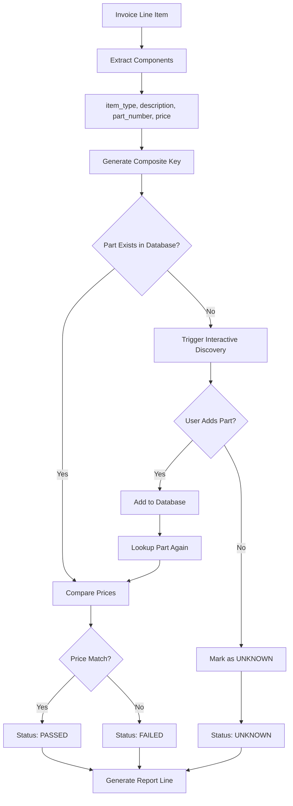

# Invoice Rate Detection System - Streamlined Validation Logic Specification

**Document Version**: 2.0  
**Date**: August 26, 2025  
**Author**: System Architect  
**Status**: ACTIVE (Replaces v1.0)

---

## Table of Contents

1. [Overview](#overview)
2. [Design Philosophy](#design-philosophy)
3. [Streamlined Validation Workflow](#streamlined-validation-workflow)
4. [Composite Key Validation](#composite-key-validation)
5. [Price Validation Logic](#price-validation-logic)
6. [Unknown Part Handling](#unknown-part-handling)
7. [Error Handling and Recovery](#error-handling-and-recovery)
8. [Implementation Architecture](#implementation-architecture)
9. [Configuration Parameters](#configuration-parameters)
10. [Testing Strategy](#testing-strategy)

---

## Overview

The Invoice Rate Detection System uses a **streamlined, simple validation approach** that prioritizes clarity, maintainability, and effectiveness over complex architectural patterns. This specification reflects the actual implemented system that successfully meets business requirements.

### Key Design Principles

- **KISS (Keep It Simple, Stupid)**: Simple solutions are better than complex ones
- **Composite Key Validation**: Parts identified by `item_type|description|part_number`
- **Interactive Discovery**: Unknown parts trigger user interaction to add them to database
- **Binary Price Validation**: Prices either match database (within tolerance) or they don't
- **Single Responsibility**: One method handles all validation logic clearly and efficiently

---

## Design Philosophy

### Why Simple is Better

The original v1.0 specification proposed 8 sequential validation phases with Strategy patterns. Analysis revealed this was **over-engineered** for a desktop application with:
- Single user
- Simple business rules
- Clear success criteria
- No complex compliance requirements

### Current Implementation Benefits

- ✅ **130 lines of clear, readable code** vs. hundreds of lines of complex patterns
- ✅ **Easy to understand and maintain** for future developers
- ✅ **Proven to work** in the existing system
- ✅ **Follows YAGNI principle** - implements only what's needed
- ✅ **Testable and debuggable** with straightforward logic flow

---

## Streamlined Validation Workflow

### Single-Method Validation Flow



### Implementation in Code

```python
def _validate_single_part(self, part_data: Dict[str, Any], validation_mode: str) -> Dict[str, Any]:
    """
    Simple, effective validation in a single method.
    
    Steps:
    1. Extract part components
    2. Look up part by composite key
    3. If not found, trigger discovery
    4. Compare prices
    5. Return validation result
    """
    # Extract components
    item_type = db_fields.get('item_type')
    description = db_fields.get('description', '')
    part_number = db_fields.get('part_number')
    extracted_price = db_fields.get('authorized_price')
    
    # Composite key lookup
    existing_part = self.db_manager.find_part_by_components(item_type, description, part_number)
    
    if not existing_part:
        # Interactive discovery (fail-fast for unknown parts)
        discovery_result = self.discovery_service.discover_and_add_parts(part_data)
        existing_part = self.db_manager.find_part_by_components(item_type, description, part_number)
    
    if existing_part:
        # Price comparison
        authorized_price = float(existing_part.authorized_price)
        price_diff = abs(float(extracted_price) - authorized_price)
        
        if price_diff <= float(self.config.price_tolerance):
            return {'validation_status': 'PASSED', 'database_price': authorized_price}
        else:
            return {'validation_status': 'FAILED', 'database_price': authorized_price}
    else:
        return {'validation_status': 'UNKNOWN', 'database_price': None}
```

---

## Composite Key Validation

### Composite Key Structure

Parts are uniquely identified by combining three components:
```
composite_key = f"{item_type}|{description}|{part_number}"
```

### Component Normalization

```python
@staticmethod
def normalize_component(component: Optional[str]) -> str:
    """Normalize component for consistent matching."""
    if not component:
        return ""
    
    # Strip whitespace and convert to uppercase
    normalized = str(component).strip().upper()
    
    # Replace multiple spaces with single space
    normalized = re.sub(r'\s+', ' ', normalized)
    
    return normalized
```

### Examples

| Item Type | Description | Part Number | Composite Key |
|-----------|-------------|-------------|---------------|
| Rent | SHIRT WORK LS BTN COTTON | GS0448 | `RENT|SHIRT WORK LS BTN COTTON|GS0448` |
| Charge | FREIGHT | | `CHARGE|FREIGHT|` |
| | SAFETY VEST | GP0171NAVY | `|SAFETY VEST|GP0171NAVY` |

---

## Price Validation Logic

### Simple Binary Validation

```python
def validate_price_match(invoice_price: Decimal, database_price: Decimal, 
                        tolerance: Decimal = Decimal('0.001')) -> bool:
    """
    Simple price validation: match or no match.
    
    Args:
        invoice_price: Price from invoice
        database_price: Authorized price from database
        tolerance: Floating-point precision tolerance
        
    Returns:
        True if prices match within tolerance, False otherwise
    """
    price_difference = abs(invoice_price - database_price)
    return price_difference <= tolerance
```

### No "Reasonableness" Validation

- ❌ **Removed**: Complex price reasonableness checks
- ❌ **Removed**: Multiple severity levels for price discrepancies
- ✅ **Simple**: Price either matches database or it doesn't
- ✅ **Clear**: Binary pass/fail result

### Tolerance Configuration

- **Default**: 0.001 (handles floating-point precision)
- **Configurable**: Via `price_tolerance` setting
- **Purpose**: Handle minor arithmetic differences only

---

## Unknown Part Handling

### Interactive Discovery Process

When a part is not found in the database:

1. **Stop validation** for that part (fail-fast)
2. **Prompt user** with part details
3. **Collect authorized price** from user
4. **Add part to database** with composite key
5. **Retry validation** with newly added part

### Discovery User Interface

```
🔍 Unknown Part Discovered: GS0448
   Invoice: INV-12345 (2025-08-26)
   Description: SHIRT WORK LS BTN COTTON
   Invoice Price: $1.15
   Quantity: 2

Options:
  1) Add part to database with this price ($1.15)
  2) Add part to database with different price
  3) Skip this part (mark as unknown)

Enter choice (1-3): 
```

### Batch Mode Handling

For non-interactive processing:
- Collect unknown parts for later review
- Generate report with UNKNOWN status
- Provide summary of parts needing attention

---

## Error Handling and Recovery

### Error Categories

#### Critical Errors (Stop Processing)
- **Missing Data**: No part number, description, or item_type
- **Invalid Price**: Non-numeric or negative prices
- **Database Errors**: Connection failures, constraint violations

#### Recoverable Errors (Continue Processing)
- **Unknown Parts**: Trigger discovery process
- **Price Mismatches**: Log and continue with other parts

### Recovery Strategies

```python
def handle_validation_error(self, error: Exception, part_data: Dict) -> Dict:
    """Simple error handling with clear recovery paths."""
    if isinstance(error, PartNotFoundError):
        # Trigger discovery
        return self._handle_unknown_part(part_data)
    elif isinstance(error, ValidationError):
        # Log and mark as failed
        return {'validation_status': 'FAILED', 'validation_errors': [str(error)]}
    else:
        # Unexpected error - log and continue
        self.logger.error(f"Unexpected validation error: {error}")
        return {'validation_status': 'FAILED', 'validation_errors': ['Validation error occurred']}
```

---

## Implementation Architecture

### Single Class Design

```python
class ValidationEngine:
    """
    Simple validation engine with single responsibility.
    
    Key Methods:
    - validate_invoice_json(): Main entry point
    - _validate_single_part(): Core validation logic
    - _create_error_line(): Report generation
    """
    
    def __init__(self, db_manager: DatabaseManager, config: ValidationConfiguration):
        self.db_manager = db_manager
        self.config = config
        self.discovery_service = SimplePartDiscoveryService(db_manager)
        self.logger = logging.getLogger(__name__)
```

### No Strategy Pattern

- ❌ **Removed**: Complex strategy interfaces
- ❌ **Removed**: Multiple validation strategy classes
- ✅ **Simple**: Single method with clear logic flow
- ✅ **Maintainable**: Easy to understand and modify

### Dependencies

- **DatabaseManager**: For part lookups and storage
- **SimplePartDiscoveryService**: For interactive discovery
- **ValidationConfiguration**: For configurable parameters

---

## Configuration Parameters

### Simple Configuration

```python
@dataclass
class ValidationConfiguration:
    """Minimal configuration for validation behavior."""
    
    # Price validation
    price_tolerance: Decimal = Decimal('0.001')
    
    # Discovery behavior
    interactive_discovery: bool = True
    
    # Logging level
    log_level: str = 'INFO'
```

### Database Configuration

Stored in `config` table:
```sql
INSERT INTO config (key, value, data_type, description) VALUES
('validation_mode', 'parts_based', 'string', 'Always use parts-based validation'),
('price_tolerance', '0.001', 'number', 'Price comparison tolerance'),
('interactive_discovery', 'true', 'boolean', 'Enable interactive part discovery');
```

---

## Testing Strategy

### Unit Tests

```python
def test_validate_single_part_existing():
    """Test validation of part that exists in database."""
    
def test_validate_single_part_unknown():
    """Test validation triggers discovery for unknown part."""
    
def test_validate_single_part_price_match():
    """Test price comparison within tolerance."""
    
def test_validate_single_part_price_mismatch():
    """Test price comparison outside tolerance."""
```

### Integration Tests

```python
def test_empty_database_scenario():
    """Test complete workflow with empty parts database."""
    
def test_interactive_discovery_workflow():
    """Test user interaction during part discovery."""
    
def test_batch_processing():
    """Test processing multiple invoices."""
```

### Test Data

```python
SAMPLE_PART_DATA = {
    'database_fields': {
        'item_type': 'Rent',
        'description': 'SHIRT WORK LS BTN COTTON',
        'part_number': 'GS0448',
        'authorized_price': 1.15
    },
    'lineitem_fields': {
        'line_number': 1,
        'quantity': 2,
        'total': 2.30
    }
}
```

---

## Migration from v1.0 Specification

### What Changed

| v1.0 (Complex) | v2.0 (Simple) | Reason |
|----------------|---------------|---------|
| 8 Sequential Phases | Single Method | Over-engineered for desktop app |
| Strategy Pattern | Direct Implementation | YAGNI - not needed |
| Complex Anomaly System | Simple Pass/Fail/Unknown | Clearer business logic |
| Format Structure Validation | Removed | No evidence it's needed |
| Business Rules Validation | Simplified | Price match is sufficient |

### What Stayed

- ✅ Composite key validation
- ✅ Interactive discovery
- ✅ Price comparison logic
- ✅ Database integration
- ✅ Report generation

---

## Conclusion

This streamlined specification reflects the **actual working system** that successfully meets business requirements. By embracing simplicity over complexity, we achieve:

- **Maintainable Code**: Easy to understand and modify
- **Reliable Operation**: Proven to work in practice
- **Clear Logic**: Binary decisions with obvious outcomes
- **Efficient Development**: Less code to write, test, and debug

**Key Insight**: The best architecture is often the simplest one that solves the problem effectively. This validation system demonstrates that complex patterns aren't always necessary - sometimes a single, well-written method is the perfect solution.