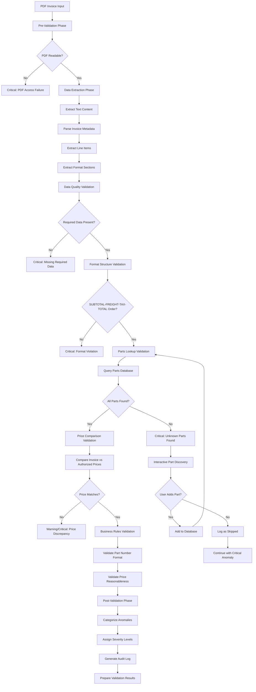

# Invoice Rate Detection System - Validation Logic Specification

**Document Version**: 1.0  
**Date**: July 29, 2025  
**Author**: System Architect  

---

## Table of Contents

1. [Overview](#overview)
2. [Validation Workflow Architecture](#validation-workflow-architecture)
3. [Anomaly Classification System](#anomaly-classification-system)
4. [Price Validation Logic](#price-validation-logic)
5. [Format Structure Validation](#format-structure-validation)
6. [Unknown Part Handling Logic](#unknown-part-handling-logic)
7. [Data Quality Validation Rules](#data-quality-validation-rules)
8. [Business Rules Validation](#business-rules-validation)
9. [Error Handling and Recovery](#error-handling-and-recovery)
10. [Performance Optimization Strategies](#performance-optimization-strategies)
11. [Validation Configuration Parameters](#validation-configuration-parameters)
12. [Audit Trail and Logging](#audit-trail-and-logging)
13. [Validation Result Data Structures](#validation-result-data-structures)

---

## Overview

The Invoice Rate Detection System validation logic replaces the simple threshold-based approach with a comprehensive parts-based validation engine. This specification defines the complete validation workflow, anomaly detection, error handling, and user interaction patterns required to ensure invoice accuracy and data integrity.

### Key Design Principles

- **Parts-First Validation**: All line items must exist in the master parts database
- **Fail-Fast for Critical Issues**: Unknown parts, format violations, and data quality issues stop processing immediately
- **Strict Format Compliance**: Invoices must have exactly SUBTOTAL → FREIGHT → TAX → TOTAL sequence
- **Interactive Recovery**: Users can add unknown parts during processing to continue validation
- **Comprehensive Audit Trail**: All validation decisions and user interactions are logged

---

## Validation Workflow Architecture

### Validation Phases

The validation system follows a sequential workflow with fail-fast behavior for critical issues:



### Phase Descriptions

#### 1. Pre-Validation Phase
- **Purpose**: Verify PDF accessibility and basic file integrity
- **Validations**:
  - File exists and is readable
  - File is a valid PDF format
  - PDF is not password protected or corrupted
- **Failure Behavior**: Critical failure, stop processing

#### 2. Data Extraction Phase
- **Purpose**: Extract structured data from PDF content
- **Operations**:
  - Extract raw text using pdfplumber/PyPDF2
  - Parse invoice metadata (number, date)
  - Extract line items with part codes, descriptions, rates, quantities
  - Extract format sections (SUBTOTAL, FREIGHT, TAX, TOTAL)
- **Failure Behavior**: Critical failure if no text extractable

#### 3. Data Quality Validation
- **Purpose**: Ensure extracted data meets minimum quality standards
- **Validations**:
  - Invoice number present and valid format
  - Invoice date present and parseable
  - At least one line item extracted
  - Required fields populated for each line item
- **Failure Behavior**: Critical failure, stop processing

#### 4. Format Structure Validation
- **Purpose**: Enforce strict invoice format compliance
- **Validations**:
  - Exactly 4 additional lines present: SUBTOTAL, FREIGHT, TAX, TOTAL
  - Lines appear in exact sequence order
  - Each line has valid numeric values
- **Failure Behavior**: Critical failure, stop processing

#### 5. Parts Lookup Validation
- **Purpose**: Verify all parts exist in master database
- **Operations**:
  - Query parts database for each line item part number
  - Identify unknown parts
  - Trigger interactive discovery for unknown parts
- **Failure Behavior**: Critical failure for unknown parts (with recovery option)

#### 6. Price Comparison Validation
- **Purpose**: Compare invoice prices against authorized prices
- **Operations**:
  - Retrieve authorized price for each part
  - Compare with invoice price using tolerance settings
  - Calculate price discrepancies
- **Failure Behavior**: Warning or critical based on discrepancy severity

#### 7. Business Rules Validation
- **Purpose**: Apply business-specific validation rules
- **Validations**:
  - Part number format compliance
  - Price reasonableness checks
  - Quantity validation
- **Failure Behavior**: Warning level, processing continues

#### 8. Post-Validation Phase
- **Purpose**: Categorize results and prepare output
- **Operations**:
  - Categorize all detected anomalies
  - Assign severity levels
  - Generate audit log entries
  - Prepare structured validation results

---

## Anomaly Classification System

### Severity Levels

#### Critical Anomalies
- **Definition**: Issues that prevent reliable validation or indicate serious data integrity problems
- **Behavior**: Stop processing immediately, require user intervention
- **Examples**:
  - Unknown parts not in database
  - Missing required invoice sections
  - PDF unreadable or corrupted
  - Invalid invoice format structure

#### Warning Anomalies
- **Definition**: Issues that indicate potential problems but don't prevent processing
- **Behavior**: Log anomaly, continue processing, include in report
- **Examples**:
  - Price discrepancies within tolerance
  - Minor format inconsistencies
  - Unusual but valid part numbers

#### Informational Anomalies
- **Definition**: Notable events or successful validations worth logging
- **Behavior**: Log for audit trail, continue processing
- **Examples**:
  - Successful price validations
  - Parts found in database
  - User interactions logged

### Anomaly Types

#### Price Discrepancy Anomalies
- **Type Code**: `PRICE_DISCREPANCY`
- **Description**: Invoice price differs from authorized price
- **Severity Calculation**:
  - Critical: Discrepancy > 20% or > $5.00
  - Warning: Discrepancy within tolerance but notable
  - Informational: Prices match exactly

#### Missing Part Anomalies
- **Type Code**: `MISSING_PART`
- **Description**: Part number not found in master database
- **Severity**: Always Critical
- **Recovery**: Interactive part discovery workflow

#### Format Issue Anomalies
- **Type Code**: `FORMAT_VIOLATION`
- **Description**: Invoice format doesn't match expected structure
- **Severity**: Always Critical
- **Examples**:
  - Missing SUBTOTAL, FREIGHT, TAX, or TOTAL lines
  - Lines in wrong order
  - Invalid line format

#### Line Count Problem Anomalies
- **Type Code**: `LINE_COUNT_VIOLATION`
- **Description**: Incorrect number of format lines
- **Severity**: Always Critical
- **Expected**: Exactly 4 lines (SUBTOTAL, FREIGHT, TAX, TOTAL)

#### Data Quality Issue Anomalies
- **Type Code**: `DATA_QUALITY_ISSUE`
- **Description**: Extracted data fails quality checks
- **Severity**: Critical
- **Examples**:
  - Missing invoice number or date
  - Unparseable line items
  - Invalid numeric values

### Anomaly Data Structure

```python
@dataclass
class ValidationAnomaly:
    """Represents a validation anomaly detected during processing."""
    anomaly_id: str
    anomaly_type: str  # PRICE_DISCREPANCY, MISSING_PART, etc.
    severity: str      # CRITICAL, WARNING, INFORMATIONAL
    invoice_number: str
    invoice_date: str
    part_number: Optional[str]
    description: str
    details: Dict[str, Any]
    detected_at: datetime
    resolution_action: Optional[str]
    user_decision: Optional[str]
```

---

## Price Validation Logic

### Validation Strategy

The price validation system compares invoice line item prices against authorized prices stored in the master parts database with configurable tolerance settings.

### Price Comparison Algorithm

```python
def validate_price(invoice_price: Decimal, authorized_price: Decimal, 
                  tolerance: Decimal = Decimal('0.001')) -> ValidationResult:
    """
    Validate invoice price against authorized price.
    
    Args:
        invoice_price: Price found in invoice
        authorized_price: Authorized price from database
        tolerance: Acceptable variance for floating-point precision
        
    Returns:
        ValidationResult with anomaly details if discrepancy found
    """
    price_difference = abs(invoice_price - authorized_price)
    percentage_difference = (price_difference / authorized_price) * 100
    
    # Exact match within tolerance
    if price_difference <= tolerance:
        return ValidationResult(
            is_valid=True,
            severity='INFORMATIONAL',
            message='Price matches authorized amount'
        )
    
    # Determine severity based on discrepancy
    if percentage_difference > 20 or price_difference > Decimal('5.00'):
        severity = 'CRITICAL'
    elif percentage_difference > 5 or price_difference > Decimal('1.00'):
        severity = 'WARNING'
    else:
        severity = 'WARNING'
    
    return ValidationResult(
        is_valid=False,
        severity=severity,
        anomaly_type='PRICE_DISCREPANCY',
        message=f'Price discrepancy: Invoice ${invoice_price}, Authorized ${authorized_price}',
        details={
            'invoice_price': float(invoice_price),
            'authorized_price': float(authorized_price),
            'difference_amount': float(price_difference),
            'difference_percentage': float(percentage_difference)
        }
    )
```

### Price Tolerance Configuration

- **Default Tolerance**: 0.001 (for floating-point precision)
- **Configurable**: Via `price_tolerance` configuration parameter
- **Purpose**: Handle minor floating-point arithmetic differences
- **Range**: 0.0001 to 0.01 (recommended)

### Price Discrepancy Severity Rules

| Condition | Severity | Action |
|-----------|----------|---------|
| Difference ≤ tolerance | Informational | Log successful validation |
| Difference > 20% OR > $5.00 | Critical | Flag for immediate attention |
| Difference > 5% OR > $1.00 | Warning | Include in report |
| Other differences | Warning | Include in report |

---

## Format Structure Validation

### Required Invoice Structure

The system enforces strict compliance with the expected invoice format structure.

### Format Requirements

#### Line Sequence Validation
- **Required Sequence**: SUBTOTAL → FREIGHT → TAX → TOTAL
- **Order**: Must appear in exact sequence
- **Count**: Exactly 4 lines, no more, no less
- **Position**: Must appear after all line items

#### Line Format Validation
```python
def validate_format_structure(extracted_sections: List[str]) -> ValidationResult:
    """
    Validate invoice format structure compliance.
    
    Args:
        extracted_sections: List of section headers found in invoice
        
    Returns:
        ValidationResult indicating format compliance
    """
    required_sequence = ['SUBTOTAL', 'FREIGHT', 'TAX', 'TOTAL']
    
    # Check exact count
    if len(extracted_sections) != 4:
        return ValidationResult(
            is_valid=False,
            severity='CRITICAL',
            anomaly_type='LINE_COUNT_VIOLATION',
            message=f'Expected 4 format lines, found {len(extracted_sections)}',
            details={'found_sections': extracted_sections}
        )
    
    # Check exact sequence
    for i, expected in enumerate(required_sequence):
        if i >= len(extracted_sections) or extracted_sections[i] != expected:
            return ValidationResult(
                is_valid=False,
                severity='CRITICAL',
                anomaly_type='FORMAT_VIOLATION',
                message=f'Format sequence violation at position {i}: expected {expected}, found {extracted_sections[i] if i < len(extracted_sections) else "missing"}',
                details={
                    'expected_sequence': required_sequence,
                    'found_sequence': extracted_sections
                }
            )
    
    return ValidationResult(
        is_valid=True,
        severity='INFORMATIONAL',
        message='Invoice format structure is compliant'
    )
```

### Format Section Extraction

#### Section Identification Patterns
```python
FORMAT_SECTION_PATTERNS = {
    'SUBTOTAL': [
        r'SUBTOTAL\s*:?\s*\$?(\d+\.\d{2})',
        r'Sub\s*Total\s*:?\s*\$?(\d+\.\d{2})',
        r'SUBTOTAL\s+(\d+\.\d{2})'
    ],
    'FREIGHT': [
        r'FREIGHT\s*:?\s*\$?(\d+\.\d{2})',
        r'Freight\s*:?\s*\$?(\d+\.\d{2})',
        r'SHIPPING\s*:?\s*\$?(\d+\.\d{2})'
    ],
    'TAX': [
        r'TAX\s*:?\s*\$?(\d+\.\d{2})',
        r'Tax\s*:?\s*\$?(\d+\.\d{2})',
        r'SALES\s*TAX\s*:?\s*\$?(\d+\.\d{2})'
    ],
    'TOTAL': [
        r'TOTAL\s*:?\s*\$?(\d+\.\d{2})',
        r'Total\s*:?\s*\$?(\d+\.\d{2})',
        r'GRAND\s*TOTAL\s*:?\s*\$?(\d+\.\d{2})'
    ]
}
```

### Format Validation Failure Handling

- **Severity**: Always Critical
- **Behavior**: Stop processing immediately
- **User Action**: Manual review required
- **Recovery**: No automatic recovery available
- **Logging**: Full details of format violation logged

---

## Unknown Part Handling Logic

### Discovery Workflow

When unknown parts are encountered, the system provides interactive workflows for resolution.

### Interactive Part Discovery

#### Discovery Prompt Flow
```python
def handle_unknown_part(part_number: str, invoice_data: Dict) -> PartDiscoveryResult:
    """
    Handle discovery of unknown part with user interaction.
    
    Args:
        part_number: Unknown part number found in invoice
        invoice_data: Context data from invoice
        
    Returns:
        PartDiscoveryResult with user decision and actions taken
    """
    print(f"\n🔍 Unknown Part Discovered: {part_number}")
    print(f"   Invoice: {invoice_data['invoice_number']} ({invoice_data['invoice_date']})")
    print(f"   Description: {invoice_data.get('description', 'N/A')}")
    print(f"   Invoice Price: ${invoice_data['price']:.2f}")
    print(f"   Quantity: {invoice_data['quantity']}")
    
    while True:
        print("\nOptions:")
        print("  1) Add part to database with this price")
        print("  2) Add part to database with different price")
        print("  3) Skip this part (mark as unknown)")
        print("  4) Skip all remaining unknown parts")
        
        choice = input("Enter choice (1-4): ").strip()
        
        if choice == '1':
            return add_part_with_invoice_price(part_number, invoice_data)
        elif choice == '2':
            return add_part_with_custom_price(part_number, invoice_data)
        elif choice == '3':
            return skip_part(part_number, invoice_data)
        elif choice == '4':
            return skip_all_unknown_parts()
        else:
            print("Invalid choice. Please enter 1, 2, 3, or 4.")
```

#### Part Addition Workflow
```python
def add_part_with_custom_price(part_number: str, invoice_data: Dict) -> PartDiscoveryResult:
    """Add part with user-specified authorized price."""
    while True:
        price_input = input(f"Enter authorized price for {part_number}: $").strip()
        try:
            authorized_price = Decimal(price_input)
            if authorized_price <= 0:
                print("Price must be positive. Please try again.")
                continue
            break
        except (ValueError, InvalidOperation):
            print("Invalid price format. Please enter a valid dollar amount.")
    
    description = input(f"Enter description for {part_number} (optional): ").strip()
    category = input(f"Enter category for {part_number} (optional): ").strip()
    
    # Create new part
    new_part = Part(
        part_number=part_number,
        authorized_price=authorized_price,
        description=description or invoice_data.get('description'),
        category=category or None,
        source='discovered',
        first_seen_invoice=invoice_data['invoice_number']
    )
    
    # Add to database
    db_manager.create_part(new_part)
    
    # Log discovery action
    log_entry = PartDiscoveryLog(
        part_number=part_number,
        invoice_number=invoice_data['invoice_number'],
        invoice_date=invoice_data['invoice_date'],
        discovered_price=Decimal(str(invoice_data['price'])),
        authorized_price=authorized_price,
        action_taken='added',
        user_decision=f'Added with custom price ${authorized_price}',
        processing_session_id=invoice_data['session_id']
    )
    db_manager.create_discovery_log(log_entry)
    
    print(f"✅ Part {part_number} added to database with price ${authorized_price}")
    
    return PartDiscoveryResult(
        action='added',
        part=new_part,
        continue_processing=True
    )
```

### Batch Collection Mode

For non-interactive processing, unknown parts are collected for later review.

```python
def collect_unknown_part(part_number: str, invoice_data: Dict, 
                        unknown_parts_collection: List) -> None:
    """Collect unknown part for batch review."""
    unknown_part_info = {
        'part_number': part_number,
        'invoice_number': invoice_data['invoice_number'],
        'invoice_date': invoice_data['invoice_date'],
        'description': invoice_data.get('description'),
        'discovered_price': invoice_data['price'],
        'quantity': invoice_data['quantity'],
        'first_seen': datetime.now()
    }
    
    unknown_parts_collection.append(unknown_part_info)
    
    # Log discovery
    log_entry = PartDiscoveryLog(
        part_number=part_number,
        invoice_number=invoice_data['invoice_number'],
        invoice_date=invoice_data['invoice_date'],
        discovered_price=Decimal(str(invoice_data['price'])),
        action_taken='discovered',
        user_decision='collected_for_review',
        processing_session_id=invoice_data['session_id']
    )
    db_manager.create_discovery_log(log_entry)
```

### Auto-Suggestion Algorithm

The system provides intelligent price suggestions based on similar parts and historical data.

```python
def suggest_authorized_price(part_number: str, discovered_price: Decimal) -> List[PriceSuggestion]:
    """Generate price suggestions for unknown part."""
    suggestions = []
    
    # Suggestion 1: Use discovered price
    suggestions.append(PriceSuggestion(
        price=discovered_price,
        confidence=0.7,
        reason=f"Use price found in invoice (${discovered_price})"
    ))
    
    # Suggestion 2: Find similar part numbers
    similar_parts = find_similar_parts(part_number)
    if similar_parts:
        avg_price = sum(p.authorized_price for p in similar_parts) / len(similar_parts)
        suggestions.append(PriceSuggestion(
            price=avg_price,
            confidence=0.8,
            reason=f"Average price of {len(similar_parts)} similar parts (${avg_price:.2f})"
        ))
    
    # Suggestion 3: Round to common price points
    rounded_price = round_to_common_price_point(discovered_price)
    if rounded_price != discovered_price:
        suggestions.append(PriceSuggestion(
            price=rounded_price,
            confidence=0.6,
            reason=f"Rounded to common price point (${rounded_price})"
        ))
    
    return sorted(suggestions, key=lambda x: x.confidence, reverse=True)
```

---

## Data Quality Validation Rules

### Required Data Elements

The system validates that all essential data elements are present and properly formatted.

#### Invoice Metadata Validation
```python
def validate_invoice_metadata(extracted_data: Dict) -> List[ValidationResult]:
    """Validate required invoice metadata fields."""
    results = []
    
    # Invoice number validation
    if not extracted_data.get('invoice_number'):
        results.append(ValidationResult(
            is_valid=False,
            severity='CRITICAL',
            anomaly_type='DATA_QUALITY_ISSUE',
            message='Invoice number is missing',
            field='invoice_number'
        ))
    elif not is_valid_invoice_number(extracted_data['invoice_number']):
        results.append(ValidationResult(
            is_valid=False,
            severity='CRITICAL',
            anomaly_type='DATA_QUALITY_ISSUE',
            message=f'Invalid invoice number format: {extracted_data["invoice_number"]}',
            field='invoice_number'
        ))
    
    # Invoice date validation
    if not extracted_data.get('invoice_date'):
        results.append(ValidationResult(
            is_valid=False,
            severity='CRITICAL',
            anomaly_type='DATA_QUALITY_ISSUE',
            message='Invoice date is missing',
            field='invoice_date'
        ))
    elif not is_valid_date_format(extracted_data['invoice_date']):
        results.append(ValidationResult(
            is_valid=False,
            severity='CRITICAL',
            anomaly_type='DATA_QUALITY_ISSUE',
            message=f'Invalid invoice date format: {extracted_data["invoice_date"]}',
            field='invoice_date'
        ))
    
    return results
```

#### Line Item Data Validation
```python
def validate_line_item_data(line_items: List[Dict]) -> List[ValidationResult]:
    """Validate line item data quality."""
    results = []
    
    if not line_items:
        results.append(ValidationResult(
            is_valid=False,
            severity='CRITICAL',
            anomaly_type='DATA_QUALITY_ISSUE',
            message='No line items found in invoice'
        ))
        return results
    
    for i, item in enumerate(line_items):
        item_results = validate_single_line_item(item, i)
        results.extend(item_results)
    
    return results

def validate_single_line_item(item: Dict, line_number: int) -> List[ValidationResult]:
    """Validate individual line item data quality."""
    results = []
    line_prefix = f"Line {line_number + 1}"
    
    # Part number validation
    if not item.get('part_number'):
        results.append(ValidationResult(
            is_valid=False,
            severity='CRITICAL',
            anomaly_type='DATA_QUALITY_ISSUE',
            message=f'{line_prefix}: Part number is missing',
            field='part_number',
            line_number=line_number
        ))
    
    # Price validation
    if not item.get('price'):
        results.append(ValidationResult(
            is_valid=False,
            severity='CRITICAL',
            anomaly_type='DATA_QUALITY_ISSUE',
            message=f'{line_prefix}: Price is missing',
            field='price',
            line_number=line_number
        ))
    elif not is_valid_price(item['price']):
        results.append(ValidationResult(
            is_valid=False,
            severity='CRITICAL',
            anomaly_type='DATA_QUALITY_ISSUE',
            message=f'{line_prefix}: Invalid price format: {item["price"]}',
            field='price',
            line_number=line_number
        ))
    
    # Quantity validation
    if not item.get('quantity'):
        results.append(ValidationResult(
            is_valid=False,
            severity='CRITICAL',
            anomaly_type='DATA_QUALITY_ISSUE',
            message=f'{line_prefix}: Quantity is missing',
            field='quantity',
            line_number=line_number
        ))
    elif not is_valid_quantity(item['quantity']):
        results.append(ValidationResult(
            is_valid=False,
            severity='CRITICAL',
            anomaly_type='DATA_QUALITY_ISSUE',
            message=f'{line_prefix}: Invalid quantity: {item["quantity"]}',
            field='quantity',
            line_number=line_number
        ))
    
    return results
```

### PDF Readability Validation

```python
def validate_pdf_readability(pdf_path: Path) -> ValidationResult:
    """Validate PDF file accessibility and readability."""
    try:
        # Check file exists and is readable
        if not pdf_path.exists():
            return ValidationResult(
                is_valid=False,
                severity='CRITICAL',
                anomaly_type='DATA_QUALITY_ISSUE',
                message=f'PDF file not found: {pdf_path}'
            )
        
        if not pdf_path.is_file():
            return ValidationResult(
                is_valid=False,
                severity='CRITICAL',
                anomaly_type='DATA_QUALITY_ISSUE',
                message=f'Path is not a file: {pdf_path}'
            )
        
        # Try to open and extract text
        with pdfplumber.open(pdf_path) as pdf:
            if len(pdf.pages) == 0:
                return ValidationResult(
                    is_valid=False,
                    severity='CRITICAL',
                    anomaly_type='DATA_QUALITY_ISSUE',
                    message='PDF contains no pages'
                )
            
            # Extract text from first page to test readability
            first_page_text = pdf.pages[0].extract_text()
            if not first_page_text or len(first_page_text.strip()) < 10:
                return ValidationResult(
                    is_valid=False,
                    severity='CRITICAL',
                    anomaly_type='DATA_QUALITY_ISSUE',
                    message='PDF appears to contain no readable text'
                )
        
        return ValidationResult(
            is_valid=True,
            severity='INFORMATIONAL',
            message='PDF is readable and accessible'
        )
        
    except Exception as e:
        return ValidationResult(
            is_valid=False,
            severity='CRITICAL',
            anomaly_type='DATA_QUALITY_ISSUE',
            message=f'Error reading PDF: {str(e)}'
        )
```

### Text Extraction Completeness

```python
def validate_text_extraction_completeness(extracted_text: str, 
                                        pdf_path: Path) -> ValidationResult:
    """Validate that text extraction was reasonably complete."""
    if not extracted_text:
        return ValidationResult(
            is_valid=False,
            severity='CRITICAL',
            anomaly_type='DATA_QUALITY_ISSUE',
            message='No text could be extracted from PDF'
        )
    
    # Check minimum text length
    if len(extracted_text.strip()) < 100:
        return ValidationResult(
            is_valid=False,
            severity='CRITICAL',
            anomaly_type='DATA_QUALITY_ISSUE',
            message=f'Extracted text is too short ({len(extracted_text)} characters), may indicate extraction failure'
        )
    
    # Check for common invoice elements
    required_elements = ['invoice', 'total', 'date']
    missing_elements = []
    
    text_lower = extracted_text.lower()
    for element in required_elements:
        if element not in text_lower:
            missing_elements.append(element)
    
    if missing_elements:
        return ValidationResult(
            is_valid=False,
            severity='WARNING',
            anomaly_type='DATA_QUALITY_ISSUE',
            message=f'Text extraction may be incomplete, missing common elements: {missing_elements}',
            details={'missing_elements': missing_elements}
        )
    
    return ValidationResult(
        is_valid=True,
        severity='INFORMATIONAL',
        message='Text extraction appears complete'
    )
```

---

## Business Rules Validation

### Part Number Format Validation

```python
def validate_part_number_format(part_number: str) -> ValidationResult:
    """Validate part number format according to business rules."""
    if not part_number:
        return ValidationResult(
            is_valid=False,
            severity='CRITICAL',
            anomaly_type='DATA_QUALITY_ISSUE',
            message='Part number is empty'
        )
    
    # Length validation
    if len(part_number) < 2 or len(part_number) > 20:
        return ValidationResult(
            is_valid=False,
            severity='WARNING',
            anomaly_type='DATA_QUALITY_ISSUE',
            message=f'Part number length unusual: {len(part_number)} characters (expected 2-20)'
        )
    
    # Character validation - alphanumeric with allowed special characters
    if not re.match(r'^[A-Za-z0-9_\-\.]+$', part_number):
        return ValidationResult(
            is_valid=False,
            severity='WARNING',
            anomaly_type='DATA_QUALITY_ISSUE',
            message=f'Part number contains invalid characters: {part_number}'
        )
    
    # Common format patterns
    common_patterns = [
        r'^[A-Z]{2}\d{4}[A-Z]*$',  # GS0448, GP0171NAVY
        r'^[A-Z]+\d+[A-Z]*$',     # ABC123XYZ
        r'^[A-Z]+\-\d+$',         # PART-123
    ]
    
    pattern_matched = any(re.match(pattern, part_number) for pattern in common_patterns)
    
    if not pattern_matched:
        return ValidationResult(
            is_valid=True,
            severity='INFORMATIONAL',
            message=f'Part number format is unusual but valid: {part_number}'
        )
    
    return ValidationResult(
        is_valid=True,
        severity='INFORMATIONAL',
        message='Part number format is valid'
    )
```

### Price Reasonableness Validation

```python
def validate_price_reasonableness(price: Decimal, part_number: str) -> ValidationResult:
    """Validate that price
is within reasonable business ranges."""
    # Minimum price validation
    if price <= Decimal('0.01'):
        return ValidationResult(
            is_valid=False,
            severity='CRITICAL',
            anomaly_type='DATA_QUALITY_ISSUE',
            message=f'Price is unreasonably low: ${price}'
        )
    
    # Maximum price validation (configurable threshold)
    max_reasonable_price = Decimal('1000.00')  # Configurable
    if price > max_reasonable_price:
        return ValidationResult(
            is_valid=False,
            severity='WARNING',
            anomaly_type='DATA_QUALITY_ISSUE',
            message=f'Price is unusually high: ${price} (exceeds ${max_reasonable_price})'
        )
    
    # Common price point validation
    if price > Decimal('100.00') and price.as_tuple().exponent < -2:
        return ValidationResult(
            is_valid=True,
            severity='INFORMATIONAL',
            message=f'High-precision price for expensive item: ${price}'
        )
    
    return ValidationResult(
        is_valid=True,
        severity='INFORMATIONAL',
        message='Price is within reasonable range'
    )
```

### Invoice-Specific Constraints

```python
def validate_invoice_constraints(invoice_data: Dict) -> List[ValidationResult]:
    """Validate invoice-specific business constraints."""
    results = []
    
    # Date range validation
    invoice_date = parse_invoice_date(invoice_data.get('invoice_date'))
    if invoice_date:
        # Check if date is too far in the future
        if invoice_date > datetime.now().date() + timedelta(days=30):
            results.append(ValidationResult(
                is_valid=False,
                severity='WARNING',
                anomaly_type='DATA_QUALITY_ISSUE',
                message=f'Invoice date is far in the future: {invoice_date}'
            ))
        
        # Check if date is too old
        if invoice_date < datetime.now().date() - timedelta(days=365):
            results.append(ValidationResult(
                is_valid=True,
                severity='INFORMATIONAL',
                message=f'Invoice date is over 1 year old: {invoice_date}'
            ))
    
    # Line item count validation
    line_items = invoice_data.get('line_items', [])
    if len(line_items) > 100:
        results.append(ValidationResult(
            is_valid=False,
            severity='WARNING',
            anomaly_type='DATA_QUALITY_ISSUE',
            message=f'Unusually high number of line items: {len(line_items)}'
        ))
    
    # Total amount validation
    total_amount = calculate_invoice_total(line_items)
    if total_amount > Decimal('10000.00'):
        results.append(ValidationResult(
            is_valid=True,
            severity='INFORMATIONAL',
            message=f'High-value invoice: ${total_amount}'
        ))
    
    return results
```

---

## Error Handling and Recovery

### Error Classification

The system categorizes errors into different types with specific handling strategies:

#### Critical Errors (Fail-Fast)
- **Unknown Parts**: Stop processing, require user intervention
- **Format Violations**: Stop processing, manual review required
- **Data Quality Issues**: Stop processing, fix data source
- **PDF Access Failures**: Skip file, continue with next

#### Warning Errors (Continue Processing)
- **Price Discrepancies**: Log anomaly, include in report
- **Minor Format Issues**: Log warning, attempt to continue
- **Unusual Data Values**: Log for review, continue processing

#### Recovery Workflows

```python
class ValidationErrorHandler:
    """Handles validation errors with appropriate recovery strategies."""
    
    def handle_critical_error(self, error: ValidationResult, 
                            context: Dict) -> RecoveryAction:
        """Handle critical validation errors."""
        if error.anomaly_type == 'MISSING_PART':
            return self._handle_unknown_part_error(error, context)
        elif error.anomaly_type == 'FORMAT_VIOLATION':
            return self._handle_format_error(error, context)
        elif error.anomaly_type == 'DATA_QUALITY_ISSUE':
            return self._handle_data_quality_error(error, context)
        else:
            return RecoveryAction(
                action='stop_processing',
                message=f'Critical error: {error.message}',
                user_intervention_required=True
            )
    
    def _handle_unknown_part_error(self, error: ValidationResult, 
                                 context: Dict) -> RecoveryAction:
        """Handle unknown part discovery with user interaction."""
        if context.get('interactive_mode', False):
            # Interactive discovery workflow
            discovery_result = handle_unknown_part(
                error.details['part_number'], 
                context['invoice_data']
            )
            
            if discovery_result.action == 'added':
                return RecoveryAction(
                    action='retry_validation',
                    message=f'Part {error.details["part_number"]} added, retrying validation'
                )
            elif discovery_result.action == 'skip':
                return RecoveryAction(
                    action='skip_part',
                    message=f'Part {error.details["part_number"]} skipped by user'
                )
        else:
            # Batch mode - collect for later review
            collect_unknown_part(
                error.details['part_number'],
                context['invoice_data'],
                context['unknown_parts_collection']
            )
            return RecoveryAction(
                action='collect_and_continue',
                message=f'Unknown part collected for review: {error.details["part_number"]}'
            )
```

---

## Performance Optimization Strategies

### Database Lookup Optimization

```python
class OptimizedPartsLookup:
    """Optimized parts database lookup with caching and batch operations."""
    
    def __init__(self, db_manager: DatabaseManager):
        self.db_manager = db_manager
        self.parts_cache = {}
        self.cache_hit_count = 0
        self.cache_miss_count = 0
    
    def lookup_parts_batch(self, part_numbers: List[str]) -> Dict[str, Part]:
        """Lookup multiple parts in a single database operation."""
        # Check cache first
        cached_parts = {}
        uncached_parts = []
        
        for part_number in part_numbers:
            if part_number in self.parts_cache:
                cached_parts[part_number] = self.parts_cache[part_number]
                self.cache_hit_count += 1
            else:
                uncached_parts.append(part_number)
                self.cache_miss_count += 1
        
        # Batch lookup for uncached parts
        if uncached_parts:
            db_parts = self._batch_database_lookup(uncached_parts)
            
            # Update cache
            for part_number, part in db_parts.items():
                self.parts_cache[part_number] = part
            
            cached_parts.update(db_parts)
        
        return cached_parts
```

---

## Validation Configuration Parameters

### Configuration Schema

```python
@dataclass
class ValidationConfiguration:
    """Configuration parameters for validation behavior."""
    
    # Price validation settings
    price_tolerance: Decimal = Decimal('0.001')
    price_discrepancy_warning_threshold: Decimal = Decimal('1.00')
    price_discrepancy_critical_threshold: Decimal = Decimal('5.00')
    price_percentage_warning_threshold: float = 5.0
    price_percentage_critical_threshold: float = 20.0
    
    # Format validation settings
    strict_format_validation: bool = True
    required_format_sections: List[str] = field(
        default_factory=lambda: ['SUBTOTAL', 'FREIGHT', 'TAX', 'TOTAL']
    )
    
    # Part discovery settings
    interactive_discovery: bool = True
    auto_add_discovered_parts: bool = False
    batch_collect_unknown_parts: bool = True
    
    # Performance settings
    enable_validation_caching: bool = True
    cache_size: int = 1000
    batch_size: int = 50
```

---

## Audit Trail and Logging

### Audit Event Types

```python
class AuditEventType(Enum):
    """Types of audit events to log."""
    VALIDATION_STARTED = "validation_started"
    VALIDATION_COMPLETED = "validation_completed"
    VALIDATION_FAILED = "validation_failed"
    ANOMALY_DETECTED = "anomaly_detected"
    PART_DISCOVERED = "part_discovered"
    PART_ADDED = "part_added"
    USER_INTERACTION = "user_interaction"
    CONFIGURATION_CHANGED = "configuration_changed"
```

---

## Validation Result Data Structures

### Core Result Classes

```python
@dataclass
class ValidationResult:
    """Represents the result of a single validation check."""
    is_valid: bool
    severity: str  # CRITICAL, WARNING, INFORMATIONAL
    anomaly_type: Optional[str] = None
    message: str = ""
    field: Optional[str] = None
    line_number: Optional[int] = None
    details: Dict[str, Any] = field(default_factory=dict)
    timestamp: datetime = field(default_factory=datetime.now)

@dataclass
class InvoiceValidationResult:
    """Represents the complete validation result for an invoice."""
    invoice_number: str
    invoice_date: str
    invoice_path: str
    processing_session_id: str
    
    # Validation status
    is_valid: bool
    processing_successful: bool
    
    # Validation results by category
    pre_validation_results: List[ValidationResult]
    data_quality_results: List[ValidationResult]
    format_validation_results: List[ValidationResult]
    parts_lookup_results: List[ValidationResult]
    price_validation_results: List[ValidationResult]
    business_rules_results: List[ValidationResult]
    
    # Anomalies categorized by severity
    critical_anomalies: List[ValidationAnomaly]
    warning_anomalies: List[ValidationAnomaly]
    informational_anomalies: List[ValidationAnomaly]
    
    def get_all_anomalies(self) -> List[ValidationAnomaly]:
        """Get all anomalies regardless of severity."""
        return (self.critical_anomalies + 
                self.warning_anomalies + 
                self.informational_anomalies)
    
    def has_critical_issues(self) -> bool:
        """Check if invoice has critical validation issues."""
        return len(self.critical_anomalies) > 0
```

---

## Implementation Guidelines

### Validation Engine Architecture

The validation engine should be implemented using the Strategy pattern to allow for different validation approaches:

```python
class ValidationEngine:
    """Main validation engine coordinating all validation phases."""
    
    def __init__(self, db_manager: DatabaseManager, config: ValidationConfiguration):
        self.db_manager = db_manager
        self.config = config
        self.audit_manager = AuditTrailManager(db_manager)
        self.error_handler = ValidationErrorHandler()
        
        # Initialize validation strategies
        self.validators = {
            'pre_validation': PreValidationStrategy(),
            'data_quality': DataQualityValidationStrategy(),
            'format_structure': FormatStructureValidationStrategy(),
            'parts_lookup': PartsLookupValidationStrategy(db_manager),
            'price_comparison': PriceComparisonValidationStrategy(),
            'business_rules': BusinessRulesValidationStrategy()
        }
    
    def validate_invoice(self, invoice_path: Path) -> InvoiceValidationResult:
        """Validate a single invoice through all validation phases."""
        session_id = str(uuid.uuid4())
        start_time = datetime.now()
        
        try:
            # Initialize result structure
            result = InvoiceValidationResult(
                invoice_number="",
                invoice_date="",
                invoice_path=str(invoice_path),
                processing_session_id=session_id,
                is_valid=True,
                processing_successful=False,
                processing_start_time=start_time,
                processing_end_time=start_time,
                processing_duration=0.0,
                pre_validation_results=[],
                data_quality_results=[],
                format_validation_results=[],
                parts_lookup_results=[],
                price_validation_results=[],
                business_rules_results=[],
                critical_anomalies=[],
                warning_anomalies=[],
                informational_anomalies=[],
                unknown_parts_discovered=[],
                parts_added_during_processing=[]
            )
            
            # Execute validation phases sequentially
            context = {'invoice_path': invoice_path, 'session_id': session_id}
            
            for phase_name, validator in self.validators.items():
                phase_results = validator.validate(context)
                
                # Store results by phase
                getattr(result, f'{phase_name}_results').extend(phase_results)
                
                # Check for critical errors that require stopping
                critical_errors = [r for r in phase_results if r.severity == 'CRITICAL']
                if critical_errors:
                    # Attempt error recovery
                    recovery_action = self.error_handler.handle_critical_error(
                        critical_errors[0], context
                    )
                    
                    if recovery_action.action == 'stop_processing':
                        result.is_valid = False
                        break
                    elif recovery_action.action == 'retry_validation':
                        # Retry the current phase
                        phase_results = validator.validate(context)
                        getattr(result, f'{phase_name}_results').extend(phase_results)
            
            # Categorize all anomalies by severity
            all_results = (result.pre_validation_results + 
                          result.data_quality_results +
                          result.format_validation_results +
                          result.parts_lookup_results +
                          result.price_validation_results +
                          result.business_rules_results)
            
            for validation_result in all_results:
                if not validation_result.is_valid:
                    anomaly = self._create_anomaly_from_result(validation_result, result)
                    
                    if validation_result.severity == 'CRITICAL':
                        result.critical_anomalies.append(anomaly)
                    elif validation_result.severity == 'WARNING':
                        result.warning_anomalies.append(anomaly)
                    else:
                        result.informational_anomalies.append(anomaly)
            
            # Final validation status
            result.is_valid = len(result.critical_anomalies) == 0
            result.processing_successful = True
            
        except Exception as e:
            logger.error(f"Validation failed for {invoice_path}: {e}")
            result.processing_successful = False
            result.is_valid = False
        
        finally:
            result.processing_end_time = datetime.now()
            result.processing_duration = (
                result.processing_end_time - result.processing_start_time
            ).total_seconds()
            
            # Log completion
            self.audit_manager.log_event(
                AuditEventType.VALIDATION_COMPLETED,
                f"Validation completed for {invoice_path}",
                invoice_number=result.invoice_number,
                event_data=result.get_summary_statistics()
            )
        
        return result
```

---

## Conclusion

This validation logic specification provides a comprehensive framework for implementing robust, parts-based invoice validation with the following key capabilities:

### Core Features Delivered
- **Complete Validation Workflow**: Sequential validation phases with fail-fast behavior
- **Comprehensive Anomaly Classification**: Critical, Warning, and Informational severity levels
- **Interactive Part Discovery**: User-guided workflows for handling unknown parts
- **Strict Format Validation**: Enforced SUBTOTAL → FREIGHT → TAX → TOTAL sequence
- **Performance Optimization**: Caching, batch processing, and efficient database lookups
- **Comprehensive Audit Trail**: Complete logging of all validation decisions and user interactions

### Implementation Benefits
- **Maintainable Architecture**: Strategy pattern allows for easy extension and modification
- **User-Friendly Error Handling**: Clear error messages with guided recovery workflows
- **Scalable Performance**: Optimized for processing large batches of invoices
- **Configurable Behavior**: Extensive configuration options for different business needs
- **Complete Audit Trail**: Full accountability and traceability of all validation decisions

### Next Steps
This specification serves as the foundation for implementing the validation engine. The next phase should focus on:
1. Implementing the core validation strategies
2. Building the interactive user interface components
3. Creating comprehensive test suites
4. Integrating with the existing CLI and database layers

The specification ensures that the validation system will be robust, user-friendly, and maintainable while meeting all the business requirements for accurate invoice validation.