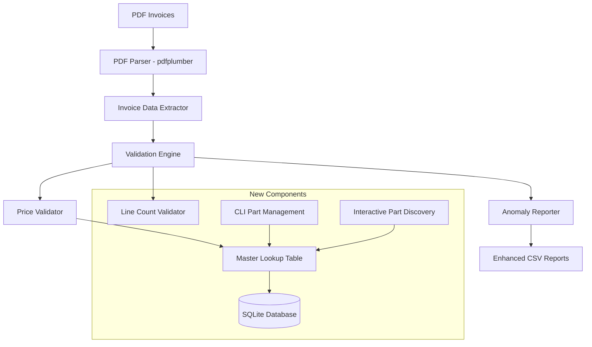

# Invoice Rate Detection System - Project Scope

**Client:** Southern Safety Supply  
**Prepared by:** Clarity Business Solutions  
**Date:** July 16, 2025  
**Version:** 2.0 (Enhanced Scope)

## Executive Summary

This document outlines the enhanced scope for the Invoice Rate Detection System following customer feedback and requirements clarification. The system has evolved from a simple threshold-based checker to a comprehensive invoice validation platform with master data management capabilities.

## Original Proposal Requirements

### Core Objectives (From Original Proposal)
- **Automate Detection**: Tool that flags overcharged line items across batches of PDF invoices
- **Summarized Reports**: Outputs clear, Excel-friendly reports
- **User-Friendly**: Runs on Windows desktop with simple double-click or CLI usage
- **Validation Layer**: Simulated and known invoice data used to verify accuracy
- **Optional GUI**: Desktop interface for non-technical users
- **Optional Docker Deployment**: For containerized environments

### Original Technical Approach
- CLI-based invoice checker using `pdfplumber` and `pandas`
- Configurable threshold detection (default $0.30)
- CSV/TXT report output
- Python-based Windows-ready tool

## Enhanced Requirements (Post-Customer Feedback)

### 1. Master Lookup Table System
**NEW REQUIREMENT**: Replace threshold-based detection with master parts database

#### Features:
- SQLite database storing part numbers and authorized prices
- User-editable part management with full CRUD operations
- Price comparison validation against authorized prices (not thresholds)
- Part discovery and addition during invoice processing

#### Database Schema:
```sql
-- Parts master table
CREATE TABLE parts (
    part_number TEXT PRIMARY KEY,
    authorized_price DECIMAL(10,2) NOT NULL,
    description TEXT,
    source TEXT DEFAULT 'manual',
    first_seen_invoice TEXT,
    created_date TIMESTAMP DEFAULT CURRENT_TIMESTAMP,
    last_updated TIMESTAMP DEFAULT CURRENT_TIMESTAMP
);

-- Configuration table
CREATE TABLE config (
    key TEXT PRIMARY KEY,
    value TEXT NOT NULL,
    description TEXT
);

-- Part discovery tracking
CREATE TABLE part_discovery_log (
    id INTEGER PRIMARY KEY AUTOINCREMENT,
    part_number TEXT,
    invoice_number TEXT,
    discovered_price DECIMAL(10,2),
    action_taken TEXT,
    discovery_date TIMESTAMP DEFAULT CURRENT_TIMESTAMP
);
```

### 2. Enhanced Validation Engine
**ENHANCED REQUIREMENT**: Dual validation system

#### Validation Types:
1. **Price Validation**: Compare invoice prices against authorized prices in lookup table
2. **Line Count Validation**: Ensure exactly 4 additional lines in correct order:
   - SUBTOTAL
   - FREIGHT
   - TAX
   - TOTAL

#### Anomaly Detection:
- **Price Anomalies**: Invoice price ≠ authorized price
- **Missing Parts**: Part numbers not in lookup table
- **Line Count Anomalies**: Missing, extra, or out-of-order additional lines
- **Format Anomalies**: Unparseable invoice sections

### 3. Interactive Part Discovery
**NEW REQUIREMENT**: Handle unknown parts during processing

#### Features:
- Interactive mode for adding unknown parts during processing
- Batch collection of unknown parts for later review
- Auto-suggestion of authorized prices based on invoice data
- Part discovery history and audit trail
- Bulk import/export capabilities for parts management

### 4. Enhanced CLI Interface
**ENHANCED REQUIREMENT**: Comprehensive part management commands

#### Part Management Commands:
```bash
# CRUD Operations
invoice-checker parts add --number "GP0171NAVY" --price 15.50 --description "Navy Work Pants"
invoice-checker parts update --number "GP0171NAVY" --price 16.00
invoice-checker parts list
invoice-checker parts get --number "GP0171NAVY"
invoice-checker parts delete --number "GP0171NAVY"

# Bulk Operations
invoice-checker parts import --file parts.csv
invoice-checker parts export --file my_parts.csv
invoice-checker parts bulk-update --file price_updates.csv

# Discovery Management
invoice-checker parts discovered
invoice-checker parts discovery-log --part "GP0171NAVY"
invoice-checker parts review-recent --days 7

# Database Management
invoice-checker parts stats
invoice-checker parts backup --file backup.db
invoice-checker parts restore --file backup.db
```

#### Processing Commands:
```bash
# Enhanced processing with part discovery
invoice-checker process --folder ./invoices --output report.csv --interactive
invoice-checker process --folder ./invoices --collect-unknown
invoice-checker process --folder ./invoices --export-unknown unknown_parts.csv
```

## Technical Architecture

### System Components


### Technology Stack
- **Core Language**: Python 3.8+
- **PDF Processing**: pdfplumber
- **Data Processing**: pandas
- **Database**: SQLite3
- **CLI Framework**: Click or argparse
- **Testing**: pytest
- **Packaging**: setuptools/wheel

## Deliverables

### Phase 1: Enhanced CLI Tool + Database ($1,750 USD)
**Timeline: 3-4 days (24-32 hours total with AI assistance)**

#### Core Deliverables:
1. **Enhanced CLI Application** *(8-10 hours with AI)*
   - PDF processing with dual validation *(3 hours)*
   - Complete part management CRUD interface *(2.5 hours)*
   - Interactive part discovery during processing *(1.5 hours)*
   - Batch processing with unknown part collection *(1 hour)*
   - Enhanced reporting with anomaly categorization *(1 hour)*

2. **SQLite Database System** *(5-6 hours with AI)*
   - Master parts table with full schema *(1.5 hours)*
   - Configuration management *(1 hour)*
   - Part discovery audit trail *(1.5 hours)*
   - Database backup/restore functionality *(1-2 hours)*

3. **Validation Engine** *(4-5 hours with AI)*
   - Price comparison against lookup table *(1.5 hours)*
   - Line count validation (SUBTOTAL, FREIGHT, TAX, TOTAL) *(1 hour)*
   - Comprehensive anomaly detection and classification *(1 hour)*
   - Error handling and graceful degradation *(1.5 hours)*

4. **Enhanced Reporting** *(2-3 hours with AI)*
   - CSV reports organized by invoice number *(1 hour)*
   - Anomaly categorization and severity levels *(0.5 hours)*
   - Unknown parts summary reports *(0.5 hours)*
   - Processing statistics and metrics *(0.5-1 hours)*

5. **Documentation Package** *(2-3 hours with AI)*
   - Installation and setup guide *(0.5 hours)*
   - Complete CLI command reference *(0.5 hours)*
   - User workflow documentation *(0.5 hours)*
   - Database schema documentation *(0.5 hours)*
   - Troubleshooting guide *(0.5-1 hours)*

6. **Testing Suite** *(3-5 hours with AI)*
   - Unit tests for all core components *(1.5-2.5 hours)*
   - Integration tests for end-to-end workflows *(1-1.5 hours)*
   - Sample invoice data for validation *(0.5 hours)*
   - Test coverage reports *(0.5 hours)*

### Phase 2: Optional GUI Interface (+$750 USD)
**Timeline: +2-3 days (12-16 hours total with AI assistance)**

#### GUI Deliverables:
1. **Desktop Application** *(8-10 hours with AI)*
   - Visual part management interface *(3-4 hours)*
   - File/folder selection for invoice processing *(2 hours)*
   - Progress indicators and real-time feedback *(2 hours)*
   - Interactive part discovery dialogs *(1-2 hours)*

2. **Enhanced User Experience** *(4-6 hours with AI)*
   - Visual report preview and export *(1.5-2 hours)*
   - Database statistics dashboard *(1-1.5 hours)*
   - Part search and filtering capabilities *(1 hour)*
   - Batch operations with progress tracking *(0.5-1.5 hours)*

### Phase 3: Optional Docker Deployment (+$250 USD)
**Timeline: +1 day (6-8 hours total with AI assistance)**

#### Docker Deliverables:
1. **Containerization** *(4-5 hours with AI)*
   - Multi-stage Dockerfile for optimized builds *(1.5-2 hours)*
   - Docker Compose configuration *(1.5 hours)*
   - Volume management for persistent data *(1 hour)*

2. **Deployment Documentation** *(2-3 hours with AI)*
   - Container deployment instructions *(1 hour)*
   - Environment configuration guide *(1 hour)*
   - Scaling and maintenance procedures *(0.5-1 hours)*

## Success Metrics

### Functional Requirements
- ✅ Process PDF invoices without errors or crashes
- ✅ Accurately detect price anomalies against master lookup table
- ✅ Validate invoice line count structure (4 additional lines)
- ✅ Enable user to manage parts database independently
- ✅ Handle unknown parts discovery during processing
- ✅ Generate comprehensive reports organized by invoice

### Performance Requirements
- Process 100+ invoices in under 5 minutes
- Database operations complete in under 1 second
- Memory usage remains under 500MB during processing
- Support databases with 10,000+ parts without performance degradation

### User Experience Requirements
- Ms. Sizemore can run the process independently
- Time spent reviewing invoices reduced by 80% or more
- Unknown parts can be added without interrupting workflow
- Clear error messages and recovery guidance provided

## Risk Mitigation

### Technical Risks
- **PDF Format Variations**: Comprehensive testing with multiple invoice formats
- **Database Corruption**: Automated backup system and recovery procedures
- **Performance Degradation**: Optimized queries and indexing strategy

### User Adoption Risks
- **Learning Curve**: Comprehensive documentation and training materials
- **Data Migration**: Tools for importing existing part data
- **Workflow Integration**: Flexible processing modes (interactive vs. batch)

## Change Management

### Scope Changes from Original Proposal
1. **Database Integration**: +$300 (SQLite implementation and schema design)
2. **Enhanced Validation Logic**: +$200 (dual validation system)
3. **Interactive Part Discovery**: +$200 (unknown part handling)
4. **Enhanced CLI Interface**: +$50 (additional commands and features)

### Total Revised Cost (With AI Coding Assistant)
- **Phase 1**: $1,750 USD (24-32 hours @ $55-73/hour)
- **Phase 2**: +$750 USD (12-16 hours @ $47-63/hour)
- **Phase 3**: +$250 USD (6-8 hours @ $31-42/hour)

### Time Breakdown Summary (AI-Assisted Development)
| Phase | Component | Human Hours | AI Efficiency | Rate Range |
|-------|-----------|-------------|---------------|------------|
| **Phase 1** | Enhanced CLI Application | 8-10 | 60% reduction | $55-73/hr |
| | SQLite Database System | 5-6 | 58% reduction | $55-73/hr |
| | Validation Engine | 4-5 | 58% reduction | $55-73/hr |
| | Enhanced Reporting | 2-3 | 63% reduction | $55-73/hr |
| | Documentation Package | 2-3 | 63% reduction | $55-73/hr |
| | Testing Suite | 3-5 | 58% reduction | $55-73/hr |
| **Phase 2** | Desktop Application | 8-10 | 60% reduction | $47-63/hr |
| | Enhanced User Experience | 4-6 | 60% reduction | $47-63/hr |
| **Phase 3** | Containerization | 4-5 | 58% reduction | $31-42/hr |
| | Deployment Documentation | 2-3 | 63% reduction | $31-42/hr |

**Total Project Hours with AI: 42-56 hours (60% reduction from manual development)**

### AI Development Advantages
- **Code Generation**: AI assists with boilerplate code, database schemas, and CLI frameworks
- **Testing Automation**: AI generates comprehensive test suites and edge cases
- **Documentation**: AI creates technical documentation, user guides, and API references
- **Debugging**: AI helps identify and resolve issues faster
- **Best Practices**: AI ensures adherence to coding standards and security practices

## Next Steps

1. **Scope Approval**: Confirm enhanced deliverables and revised pricing
2. **Sample Data Collection**: Provide additional invoice samples for testing
3. **Initial Parts Data**: Determine if existing parts list available for import
4. **Development Kickoff**: Begin Phase 1 development with database design
5. **Regular Check-ins**: Weekly progress updates and milestone reviews

---

**Document Control**
- **Version**: 2.0
- **Last Updated**: July 16, 2025
- **Next Review**: Upon scope approval
- **Approved By**: [Pending Customer Approval]